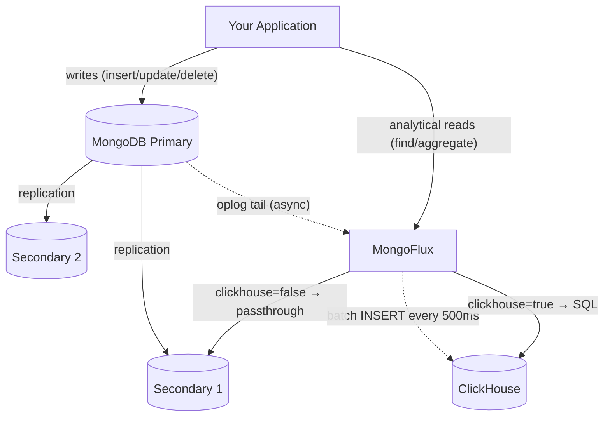

# MongoFlux

Real-time MongoDB → ClickHouse replication with transparent query routing.

ClickHouse becomes a "virtual secondary" in your replica set — same write stream, zero overhead on the write path, and analytical queries run 50-136x faster than MongoDB aggregations at scale.

## The Problem

MongoDB is great for OLTP. Point lookups, single-doc writes, transactions — all fast. But the moment you need analytics (GROUP BY over millions of rows, time-range scans, percentiles), it falls apart. You end up building ETL pipelines, maintaining a separate warehouse, dealing with stale data. And the classic workaround — reading from one system, writing to another — means your application code splits into two paths, two connection strings, two query languages.

MongoFlux fixes this. Your app talks to one place for both reads and writes. No code changes, no query rewrites. Internally, MongoFlux tails the oplog in real-time (exactly like a secondary node does), replicates to ClickHouse, and routes analytical queries there transparently. You just set `?clickhouse=true` once in your read connection string and everything else stays the same — same `find()`, same `aggregate()`, same MongoDB query syntax. MongoFlux translates it to SQL behind the scenes.

No ETL. No batch jobs. No data staleness.

## How it works



Three things happen:

1. **Writes** go directly to MongoDB. MongoFlux is not in the write path at all.
2. **Replication** — MongoFlux opens a tailable-await cursor on `local.oplog.rs` (same mechanism secondaries use), extracts the fields you've mapped, batches them, and flushes to ClickHouse via HTTP. It persists oplog timestamps so it can resume after a crash.
3. **Reads** — your app sends queries to MongoFlux. If the URI has `?clickhouse=true` (or `1`/`yes`), the query gets translated to SQL and executed on ClickHouse. Otherwise it's forwarded to a MongoDB secondary unchanged.

The query translator uses a two-phase AST approach: BSON → expression tree → ClickHouse SQL. It handles `find()` and `aggregate()` with most common operators — see the full list below.

## Benchmarks

Ran on a single machine (Docker Compose, no network hops). Real-world numbers will vary, but the relative differences hold.

### Break-even point

Tested complex aggregation queries at increasing data sizes. The question: at what point does MongoFlux become faster than MongoDB?

| Docs | MongoDB | Mongo+Index | MongoFlux | Winner |
|:-----|:--------|:------------|:----------|:-------|
| 100 | 0.8 ms | 1.4 ms | 11.6 ms | MongoDB |
| 1K | 1.9 ms | 2.5 ms | 5.9 ms | MongoDB |
| 5K | 5.8 ms | 5.6 ms | 5.8 ms | Tie |
| 10K | 10.8 ms | 12.5 ms | 8.9 ms | **MongoFlux 1.2x** |
| 50K | 38.6 ms | 37.6 ms | 4.6 ms | **MongoFlux 8.4x** |
| 100K | 61.9 ms | 64.0 ms | 10.2 ms | **MongoFlux 6.1x** |

**~10K documents is the crossover.** Below that, MongoDB wins because of HTTP round-trip overhead. Above that, MongoFlux wins and the gap keeps growing — columnar scans are O(columns), not O(rows).

Indexes don't help here. They're designed for point lookups, not full-collection aggregations.

### Read performance at 1M records

| Query | MongoDB | ClickHouse | Speedup |
|:------|:--------|:-----------|:--------|
| Count by status (GROUP BY) | 565 ms | 4.2 ms | **136x** |
| Full table count | 291 ms | 2.3 ms | **129x** |
| Avg amount by region | 663 ms | 6.3 ms | **105x** |
| Top 10 by spend | 610 ms | 6.3 ms | **98x** |
| 2D GROUP BY (category × region) | 985 ms | 15.4 ms | **64x** |
| Date range scan (3 months) | 1,561 ms | 149 ms | **10x** |

Average: **90.3x faster** at 1M documents.

### Aggregation benchmark (1M records, 8 query patterns)

| Query | MongoDB | ClickHouse | Speedup |
|:------|:--------|:-----------|:--------|
| Count by status | 560 ms | 4.6 ms | **122x** |
| Full count | 296 ms | 2.5 ms | **120x** |
| Revenue by region | 615 ms | 5.9 ms | **103x** |
| Avg by category | 621 ms | 6.4 ms | **97x** |
| Filter + group | 516 ms | 6.6 ms | **78x** |
| Min/Max/Avg score | 707 ms | 11.1 ms | **64x** |
| Top 10 spenders | 2,972 ms | 58.6 ms | **51x** |
| 2D GROUP BY | 795 ms | 15.9 ms | **50x** |

Average: **85.7x faster**. Peak: **122x** on count-by-status.

### Write overhead

| Metric | Value |
|:-------|:------|
| Batch throughput | 32,433 docs/s |
| Single insert avg latency | 5.6 ms |

Zero overhead. MongoFlux tails the oplog asynchronously — MongoDB acks writes before the sync layer even sees them.

## Quick start

```bash
docker compose up --build
```

This starts MongoDB (3-node replica set on ports 27017-27019), ClickHouse (8123), and MongoFlux (9090). The replica set initializes automatically.

Then create a mapping:

```bash
curl -X POST http://localhost:9090/api/v1/mappings \
  -H "Content-Type: application/json" \
  -d '{
    "collection": "orders",
    "clickhouse_table": "orders",
    "clickhouse_database": "analytics",
    "fields": [
      {"mongo_field": "_id", "ch_column": "id", "ch_type": "String"},
      {"mongo_field": "amount", "ch_column": "amount", "ch_type": "Float64"},
      {"mongo_field": "status", "ch_column": "status", "ch_type": "LowCardinality(String)"},
      {"mongo_field": "created_at", "ch_column": "created_at", "ch_type": "DateTime"}
    ],
    "engine": "ReplacingMergeTree",
    "order_by": ["created_at", "id"]
  }'

# Create the ClickHouse table
curl -X POST http://localhost:9090/api/v1/mappings/orders/sync
```

That's it. Inserts to `orders` in MongoDB now replicate to ClickHouse in real-time.

## Query translation

MongoFlux translates MongoDB queries to ClickHouse SQL via a two-phase AST:

**Supported `find()` features:** filter, projection, sort, limit, skip

**Supported `aggregate()` stages:** `$match`, `$group`, `$sort`, `$limit`, `$skip`, `$project`, `$addFields`, `$set`, `$unwind`, `$count`, `$sample`

**Filter operators:** `$gt`, `$gte`, `$lt`, `$lte`, `$eq`, `$ne`, `$in`, `$nin`, `$and`, `$or`, `$nor`, `$exists`, `$regex`

**Accumulators:** `$sum`, `$avg`, `$min`, `$max`, `$count`, `$first`, `$last`, `$push`, `$addToSet`, `$stdDevPop`, `$stdDevSamp`

**Expressions:** arithmetic (`$add`, `$multiply`, `$subtract`, `$divide`, `$mod`, `$abs`, `$ceil`, `$floor`, `$round`, `$sqrt`, `$pow`), string (`$concat`, `$toUpper`, `$toLower`, `$trim`, `$substr`, `$split`, `$regexMatch`), date (`$year`, `$month`, `$dayOfMonth`, `$dayOfWeek`, `$dayOfYear`), conditional (`$cond`)

## Configuration

```yaml
mongo:
  uri: "mongodb://localhost:27017/?replicaSet=rs0"
  database: "myapp"

clickhouse:
  host: "localhost"
  port: 8123
  database: "analytics"
  user: "default"
  password: ""

sync:
  mode: "oplog"              # or "changestream" for Atlas/sharded
  batch_size: 1000
  flush_interval_ms: 500
  resume_token_path: "/var/lib/mongoflux/resume_tokens"
  max_pending_rows: 100000   # backpressure threshold
  propagate_deletes: false   # tombstone rows on delete
  delete_column: "_deleted"

api:
  port: 9090
  bind: "0.0.0.0"

routing:
  clickhouse_param: "clickhouse"

logging:
  level: "info"
  file: ""
```

| Sync mode | When to use | Requires |
|:----------|:------------|:---------|
| `oplog` | Direct replica set access, lowest latency | `local.oplog.rs` access |
| `changestream` | Atlas, sharded clusters | MongoDB 4.0+ |

Environment variable overrides use the `MG_` prefix: `MG_MONGO_URI`, `MG_CH_HOST`, `MG_CH_PORT`, `MG_CH_DB`, `MG_CH_USER`, `MG_CH_PASSWORD`.

## API

| Method | Endpoint | What it does |
|:-------|:---------|:-------------|
| GET | `/api/v1/mappings` | List all mappings |
| GET | `/api/v1/mappings/:collection` | Get one mapping |
| POST | `/api/v1/mappings` | Create/update mapping |
| DELETE | `/api/v1/mappings/:collection` | Delete mapping |
| POST | `/api/v1/mappings/:collection/sync` | Create ClickHouse table |
| GET | `/api/v1/status` | Sync status + health |
| POST | `/api/v1/sync/restart` | Restart sync threads |
| GET | `/health` | Liveness probe |
| GET | `/ready` | Readiness probe (checks CH) |
| GET | `/metrics` | Prometheus metrics |

## Distributed ClickHouse

For multi-shard deployments, add `cluster` and `sharding_key` to your mapping:

```bash
curl -X POST http://localhost:9090/api/v1/mappings \
  -H "Content-Type: application/json" \
  -d '{
    "collection": "events",
    "clickhouse_table": "events",
    "clickhouse_database": "analytics",
    "cluster": "prod-cluster",
    "sharding_key": "cityHash64(user_id)",
    "fields": [
      {"mongo_field": "_id", "ch_column": "id", "ch_type": "String"},
      {"mongo_field": "user_id", "ch_column": "user_id", "ch_type": "String"},
      {"mongo_field": "event_type", "ch_column": "event_type", "ch_type": "LowCardinality(String)"},
      {"mongo_field": "timestamp", "ch_column": "ts", "ch_type": "DateTime64(3)"}
    ],
    "engine": "ReplacingMergeTree",
    "order_by": ["event_type", "ts"]
  }'
```

MongoFlux generates both the local table (`events_local` on each shard) and the Distributed table (`events`) automatically with ON CLUSTER DDL.

## Observability

Prometheus metrics at `/metrics`:

```
mongoflux_rows_synced_total
mongoflux_rows_synced{collection="orders"}
mongoflux_flush_success_total
mongoflux_flush_failure_total
mongoflux_oplog_entries_total
mongoflux_oplog_reconnects_total
mongoflux_pending_rows
mongoflux_oplog_lag_ms
mongoflux_last_flush_duration_ms
mongoflux_sync_running
```

## Building from source

```bash
go build -o mongoflux ./cmd/mongoflux
./mongoflux /path/to/config.yaml
```

Requires: Go 1.22+

## Docker

```bash
docker build -t mongoflux .
docker run -v ./config.yaml:/etc/mongoflux/mongoflux.yaml -p 9090:9090 mongoflux
```

Alpine-based image (~17MB), runs as non-root, uses tini for signal handling. Graceful shutdown flushes pending batches and persists oplog position.

```yaml
# Kubernetes
livenessProbe:
  httpGet: { path: /health, port: 9090 }
readinessProbe:
  httpGet: { path: /ready, port: 9090 }
```

## Running the benchmarks

```bash
# Ensure MongoDB + ClickHouse are running
docker compose up -d

# Read performance (MongoDB vs ClickHouse)
go run ./cmd/benchmark -type read -records 1000000

# Write throughput
go run ./cmd/benchmark -type write -records 1000000

# Find the break-even point
go run ./cmd/benchmark -type breakeven -max-size 100000

# Aggregation patterns
go run ./cmd/benchmark -type aggregation -records 1000000

# Save results to file
go run ./cmd/benchmark -type read -records 500000 -output benchmark/results.json
```

## Tests

```bash
go test ./...
```

## Project structure

```
cmd/
  mongoflux/       Main application entry point
  benchmark/       Benchmark tool (read, write, breakeven, aggregation)
internal/
  api/             REST management API (gin)
  clickhouse/      ClickHouse HTTP client
  config/          YAML config + env overrides + validation
  metrics/         Prometheus metrics collector
  routing/         MongoDB URI parsing + routing detection
  schema/          Thread-safe mapping registry + DDL generation
  sync/            Oplog tailer + change stream CDC engine
  translator/      Two-phase query translator (BSON → AST → SQL)
```

## Contributing

Contributions are welcome. Please open an issue to discuss before submitting large changes.
