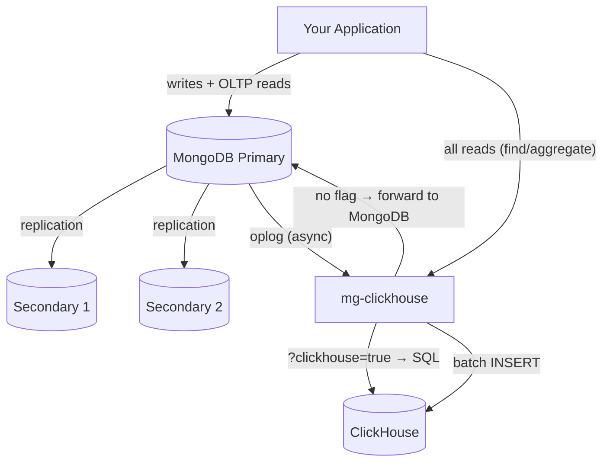

# mg-clickhouse

Real-time MongoDB to ClickHouse replication with transparent analytics query routing. Makes ClickHouse behave as a "virtual secondary" — same write stream as replica set members, zero write overhead, 12-84x faster analytical reads.

## Why: OLTP + OLAP in One Stack

MongoDB excels at OLTP (transactional reads/writes — point lookups, single-document operations, low-latency CRUD). But it struggles with OLAP (analytical queries — aggregations over millions of rows, GROUP BY, time-range scans, percentiles). These workloads have fundamentally different storage and execution requirements:

| | OLTP (MongoDB) | OLAP (ClickHouse) |
|:--|:---------------|:-------------------|
| Storage | Row-oriented (full documents) | Column-oriented (only needed columns scanned) |
| Strength | Point lookups, writes, transactions | Aggregations, scans, GROUP BY |
| Compression | ~2x | ~10-20x (columnar + codecs) |
| Scan 1M rows | 500-1500 ms | 3-40 ms |
| Typical query | `findById`, `insertOne` | `SELECT avg(amount) GROUP BY region` |

The traditional solution is ETL pipelines (batch jobs that copy data to a warehouse). mg-clickhouse eliminates ETL entirely — it replicates in real-time via the oplog (same stream MongoDB secondaries consume) and routes queries transparently. Your application keeps using MongoDB for OLTP, and analytical reads automatically go to ClickHouse with a single URI parameter.

**The result**: OLTP + OLAP from one MongoDB connection string. No ETL, no data staleness, no application changes.

## Architecture



MongoDB runs as a 3-node replica set (`rs0`): 1 primary + 2 secondaries. For reads, the application connects to mg-clickhouse which acts as a routing proxy. If the connection URI contains `?clickhouse=true`, mg-clickhouse translates the query to SQL and sends it to ClickHouse. If the parameter is absent or false, mg-clickhouse forwards the query to MongoDB Primary unchanged. Writes always go directly to the primary. Separately, mg-clickhouse tails the primary's oplog to replicate data into ClickHouse in real-time.

## Benchmark Results

### Read Performance — MongoDB vs Standalone CH vs Distributed CH (500K records, 5 iterations)

| Query | MongoDB (ms) | Standalone CH (ms) | Distributed CH 3-shard (ms) | S speedup | D speedup |
|:------|:-------------|:-------------------|:----------------------------|:----------|:----------|
| [Count by status (GROUP BY)](benchmark/distributed_results.json#L5) | 822.8 | 16.5 | 61.1 | 50.0x | 13.5x |
| [Avg amount by region](benchmark/distributed_results.json#L10) | 886.1 | 21.5 | 44.4 | 41.2x | 20.0x |
| [Top 10 customers by spend](benchmark/distributed_results.json#L15) | 1,096.8 | 88.6 | 177.6 | 12.4x | 6.2x |
| [Single-region filter (shard-local)](benchmark/distributed_results.json#L20) | 205.0 | 40.6 | 66.6 | 5.0x | 3.1x |
| [Single-region aggregation (shard-local)](benchmark/distributed_results.json#L25) | 313.2 | 30.6 | 56.1 | 10.2x | 5.6x |
| [Date range scan (all shards, parallel)](benchmark/distributed_results.json#L30) | 1,492.2 | 77.6 | 63.1 | 19.2x | 23.7x |
| [Full table count](benchmark/distributed_results.json#L35) | 447.7 | 11.8 | 36.5 | 37.8x | 12.3x |
| [Percentile + multi-agg](benchmark/distributed_results.json#L40) | 1,206.1 | 22.6 | 57.8 | 53.3x | 20.9x |
| [Heavy aggregation (uniqExact)](benchmark/distributed_results.json#L45) | 1,336.5 | 140.5 | 250.9 | 9.5x | 5.3x |

**Standalone avg: 26.5x** | **Distributed avg: 12.3x** | Distributed wins on large parallel scans (date range: 23.7x vs 19.2x). Standalone wins when data fits in single-node RAM. Distributed shines at 10M+ rows/shard.

### Write Overhead (200K records)

| Metric | Standalone MongoDB | With mg-clickhouse | Overhead |
|:-------|:-------------------|:-------------------|:---------|
| [Batch throughput](benchmark/write_results.json#L7) | 28,639 docs/s | 31,858 docs/s | ~0% |
| [Single insert avg latency](benchmark/write_results.json#L30) | 2.67 ms | 2.60 ms | ~0% |
| [Single insert P99 latency](benchmark/write_results.json#L35) | 8.25 ms | 8.08 ms | ~0% |

**Zero write overhead.** mg-clickhouse tails the oplog asynchronously — MongoDB acknowledges writes before the sync layer sees them.

Full results: [`benchmark/results.json`](benchmark/results.json), [`benchmark/write_results.json`](benchmark/write_results.json), [`benchmark/distributed_results.json`](benchmark/distributed_results.json)

## How It Works

**Replication**: Opens a tailable-await cursor on `local.oplog.rs` (same mechanism MongoDB secondaries use), extracts mapped fields, batches them, and flushes to ClickHouse via HTTP INSERT. Persists oplog timestamps for crash recovery.

**Write path**: All writes go directly to MongoDB Primary. No proxy, no application code changes needed.

**Read path**: The application sends reads to mg-clickhouse (proxy). mg-clickhouse inspects the connection URI:
- `?clickhouse=true` (or `1` / `yes`) → translates the query to SQL, executes on ClickHouse, returns results
- Parameter absent or `false` → forwards the query to MongoDB Primary unchanged

**Query translation**: Two-phase AST approach — BSON is parsed into an expression tree, then emitted as ClickHouse SQL. Supports `find()`, `aggregate()` with `$match`, `$group`, `$sort`, `$limit`, `$project`, `$count`, and filter operators (`$gt`, `$in`, `$regex`, `$and`/`$or`, etc.).

## Quick Start

```bash
docker compose up --build
```

Starts a 3-node MongoDB replica set (1 primary + 2 secondaries on ports 27017-27019), ClickHouse, and mg-clickhouse. The replica set initializes automatically. API at `http://localhost:9090`.

### Create a Mapping

```bash
curl -X POST http://localhost:9090/api/v1/mappings \
  -H "Content-Type: application/json" \
  -d '{
    "collection": "orders",
    "clickhouse_table": "orders",
    "clickhouse_database": "analytics",
    "fields": [
      {"mongo_field": "_id", "ch_column": "id", "ch_type": "String"},
      {"mongo_field": "amount", "ch_column": "amount", "ch_type": "Float64"},
      {"mongo_field": "status", "ch_column": "status", "ch_type": "LowCardinality(String)"},
      {"mongo_field": "created_at", "ch_column": "created_at", "ch_type": "DateTime CODEC(Delta(4), ZSTD(1))"}
    ],
    "engine": "ReplacingMergeTree",
    "order_by": ["created_at", "id"]
  }'

# Create the ClickHouse table
curl -X POST http://localhost:9090/api/v1/mappings/orders/sync
```

### Production Table (Advanced ClickHouse Features)

For workloads requiring codecs, bloom filters, TTL, and tiered storage — create the table directly:

```sql
CREATE TABLE IF NOT EXISTS analytics.k8s_logs ON CLUSTER 'prod-cluster'
(
    `Timestamp`          DateTime64(9) CODEC(Delta(8), ZSTD(1)),
    `TimestampTime`      DateTime DEFAULT toDateTime(Timestamp),
    `TraceId`            String CODEC(ZSTD(1)),
    `SpanId`             String CODEC(ZSTD(1)),
    `SeverityText`       LowCardinality(String) CODEC(ZSTD(1)),
    `ServiceName`        LowCardinality(String) CODEC(ZSTD(1)),
    `Body`               String CODEC(ZSTD(1)),
    `ResourceAttributes` Map(LowCardinality(String), String) CODEC(ZSTD(1)),
    `LogAttributes`      Map(LowCardinality(String), String) CODEC(ZSTD(1)),

    INDEX idx_trace_id TraceId TYPE bloom_filter(0.001) GRANULARITY 1,
    INDEX idx_res_attr_key mapKeys(ResourceAttributes) TYPE bloom_filter(0.01) GRANULARITY 1,
    INDEX idx_log_attr_key mapKeys(LogAttributes) TYPE bloom_filter(0.01) GRANULARITY 1,
    INDEX idx_body Body TYPE tokenbf_v1(32768, 3, 0) GRANULARITY 8
)
ENGINE = MergeTree
PARTITION BY toDate(Timestamp)
ORDER BY (ServiceName, Timestamp, TimestampTime)
TTL TimestampTime + toIntervalDay(7) TO VOLUME 'cold',
    TimestampTime + INTERVAL 1 YEAR
SETTINGS storage_policy = 'hot_cold', index_granularity = 8192, ttl_only_drop_parts = 1;
```

Then register the field mapping:

```bash
curl -X POST http://localhost:9090/api/v1/mappings \
  -H "Content-Type: application/json" \
  -d '{
    "collection": "k8s_logs",
    "clickhouse_table": "k8s_logs",
    "clickhouse_database": "analytics",
    "fields": [
      {"mongo_field": "timestamp", "ch_column": "Timestamp", "ch_type": "DateTime64(9)"},
      {"mongo_field": "traceId", "ch_column": "TraceId", "ch_type": "String"},
      {"mongo_field": "service", "ch_column": "ServiceName", "ch_type": "LowCardinality(String)"},
      {"mongo_field": "body", "ch_column": "Body", "ch_type": "String"},
      {"mongo_field": "resource", "ch_column": "ResourceAttributes", "ch_type": "Map(LowCardinality(String), String)"},
      {"mongo_field": "attributes", "ch_column": "LogAttributes", "ch_type": "Map(LowCardinality(String), String)"}
    ],
    "engine": "MergeTree",
    "order_by": ["ServiceName", "Timestamp"]
  }'
```

## API Reference

| Method | Endpoint | Description |
|:-------|:---------|:------------|
| `GET` | `/api/v1/mappings` | List all mappings |
| `GET` | `/api/v1/mappings/:collection` | Get mapping |
| `POST` | `/api/v1/mappings` | Create/update mapping |
| `DELETE` | `/api/v1/mappings/:collection` | Delete mapping |
| `POST` | `/api/v1/mappings/:collection/sync` | Create ClickHouse table |
| `GET` | `/api/v1/status` | Health + sync status |
| `POST` | `/api/v1/sync/restart` | Restart sync threads |
| `GET` | `/health` | Liveness probe |
| `GET` | `/ready` | Readiness probe |

## Configuration

```yaml
mongo:
  uri: "mongodb://mongo-primary:27017,mongo-secondary1:27017,mongo-secondary2:27017/?replicaSet=rs0"
  database: "myapp"

clickhouse:
  host: "localhost"
  port: 8123
  database: "analytics"
  user: "default"
  password: ""

sync:
  mode: "oplog"           # "oplog" or "changestream" (Atlas/sharded)
  batch_size: 1000
  flush_interval_ms: 500
  resume_token_path: "/var/lib/mg-clickhouse/resume_tokens"

api:
  port: 9090
  bind: "0.0.0.0"

routing:
  clickhouse_param: "clickhouse"
```

| Sync Mode | Use Case | Requirement |
|:----------|:---------|:------------|
| `oplog` | Direct replica set, lowest latency | Access to `local.oplog.rs` |
| `changestream` | Atlas, sharded clusters | MongoDB 4.0+ |

## Build

```bash
mkdir build && cd build
cmake .. -DCMAKE_BUILD_TYPE=Release
make -j$(nproc)
./mg_clickhouse /path/to/config.yaml
```

Prerequisites: C++17, CMake 3.16+, mongocxx 3.9+, libcurl, OpenSSL. nlohmann/json, cpp-httplib, and yaml-cpp are fetched via CMake FetchContent.

## Deployment

```bash
docker build -t mg-clickhouse .
docker run -v ./config.yaml:/etc/mg-clickhouse/mg-clickhouse.yaml -p 9090:9090 mg-clickhouse
```

Kubernetes probes:

```yaml
livenessProbe:
  httpGet: { path: /health, port: 9090 }
readinessProbe:
  httpGet: { path: /ready, port: 9090 }
```

Runs as non-root (`mgch`), uses `tini` for signal handling, graceful shutdown flushes pending batches and persists oplog position.

## Running Benchmarks

```bash
pip install pymongo requests

# Read benchmark
python3 benchmark/read_benchmark.py --records 1000000 --iterations 5

# Write overhead benchmark
python3 benchmark/write_benchmark.py --records 200000 --batch-size 1000
```

## License

Apache-2.0
