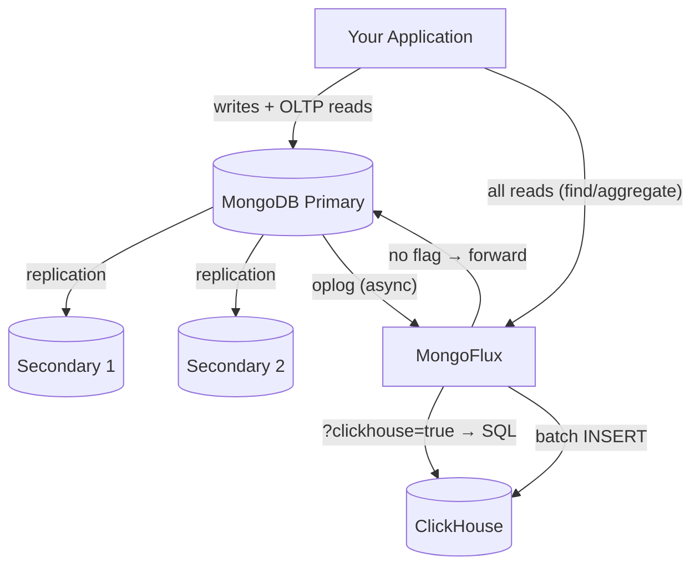
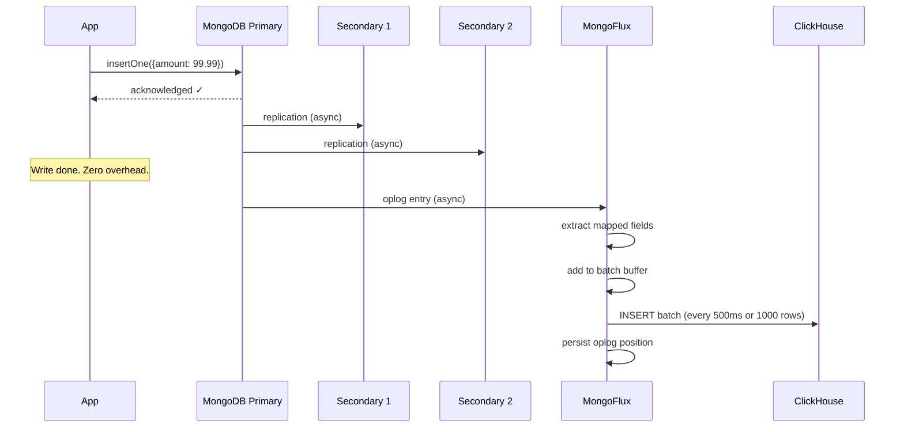
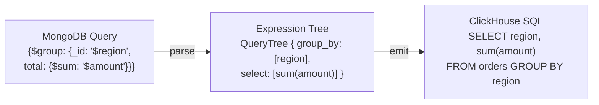
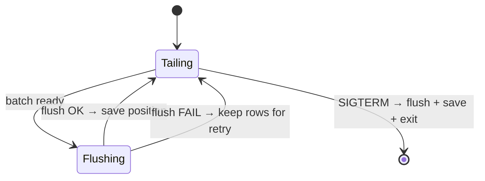
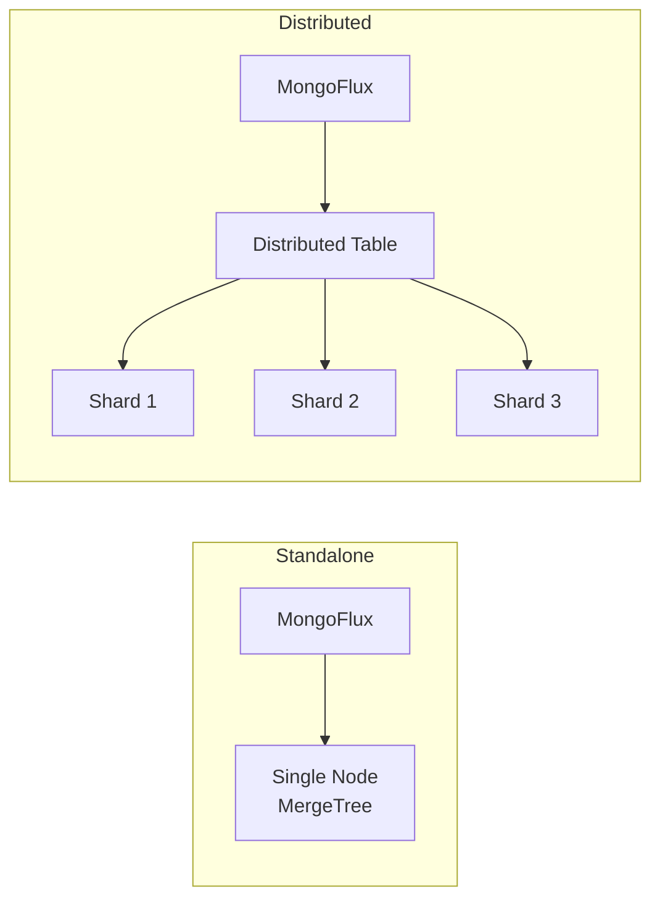
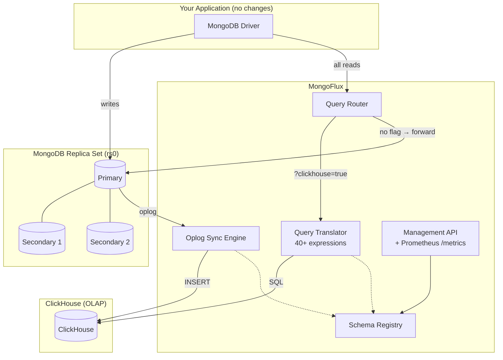

# How We Made MongoDB 40x Faster for Analytics — Without Changing a Single Line of Application Code


*Photo: Data flowing through infrastructure — representing real-time CDC replication*

---

## The Problem: MongoDB Is Great at OLTP, Terrible at OLAP

If you've ever run a `$group` aggregation on a MongoDB collection with millions of documents, you know the pain. A simple "revenue by region" query that should take milliseconds ends up taking seconds. Your dashboard times out. Your data team complains. You start thinking about ETL pipelines to a data warehouse.

Here's why: MongoDB stores data row-by-row (document-oriented). When you ask "what's the average order amount per region?", it must read every single document — even though you only need two fields out of twenty. That's the fundamental mismatch between OLTP (transactional) and OLAP (analytical) workloads.

| | OLTP (MongoDB) | OLAP (ClickHouse) |
|:--|:---------------|:-------------------|
| Storage layout | Row-oriented | Column-oriented |
| Reads 1M rows | Scans all fields | Scans only needed columns |
| Compression | ~2x | ~10-20x |
| GROUP BY 500K rows | 300-1500 ms | 8-30 ms |

We built **MongoFlux** to solve this without ETL, without data staleness, and without touching application code.

---

## The Solution: Make ClickHouse a "Virtual Secondary"

MongoDB replica sets work by having secondary nodes tail the primary's oplog (`local.oplog.rs`) — a capped collection that records every write. Secondaries apply each operation to stay in sync.

MongoFlux does exactly the same thing. It opens a tailable-await cursor on the oplog and applies operations to ClickHouse instead of a local MongoDB storage engine. From MongoDB's perspective, it's just another consumer of the write stream.

The default deployment runs a 3-node MongoDB replica set: 1 primary and 2 secondaries. For reads, the application connects to MongoFlux which acts as a routing proxy. MongoFlux inspects the connection URI — if `?clickhouse=true` is present, it translates the query to SQL and executes on ClickHouse. If the parameter is absent or false, it forwards the query to MongoDB Primary unchanged.



The key insight: writes go to the MongoDB primary unchanged (zero overhead), the two secondaries provide high availability, and MongoFlux transparently routes reads — analytics to ClickHouse, everything else to MongoDB.

---

## How It Works: Three Moving Parts

### 1. Real-Time Replication (Oplog Tailing)

MongoFlux tails the oplog from the MongoDB primary. The two secondaries handle read scaling and failover independently — they don't participate in the replication pipeline to ClickHouse.



The replication is fully async and decoupled from the write path. The primary acknowledges writes to your application before MongoFlux even sees them. If the primary fails, the replica set elects a new primary and MongoFlux automatically reconnects to continue tailing. Our benchmarks confirm zero measurable write overhead.

### 2. Query Translation (BSON → AST → SQL)

When your application sends a MongoDB aggregation pipeline, MongoFlux translates it to ClickHouse SQL through a two-phase expression tree:



This supports 12 pipeline stages, 12 accumulators, and 40+ expressions including arithmetic, string manipulation, date extraction, and conditionals.

### 3. Schema Mapping (What Gets Synced)

You define which MongoDB fields map to ClickHouse columns via a REST API:

```bash
curl -X POST http://localhost:9090/api/v1/mappings -d '{
  "collection": "orders",
  "clickhouse_table": "orders",
  "clickhouse_database": "analytics",
  "fields": [
    {"mongo_field": "_id", "ch_column": "id", "ch_type": "String"},
    {"mongo_field": "amount", "ch_column": "amount", "ch_type": "Float64"},
    {"mongo_field": "region", "ch_column": "region", "ch_type": "LowCardinality(String)"}
  ],
  "engine": "ReplacingMergeTree",
  "order_by": ["region", "id"]
}'
```

Only mapped fields are synced. Your 50-field documents become lean 5-column analytical tables.

---

## The Numbers: Benchmarked on 500K Records

We ran 20 real-world aggregation queries against both MongoDB and ClickHouse with identical data:

```mermaid
xychart-beta
    title "Query Latency: MongoDB vs ClickHouse (ms)"
    x-axis ["Count", "Revenue", "Top 10", "Monthly", "2D Group", "Filter+Agg", "Percentile", "Dashboard"]
    y-axis "Latency (ms)" 0 --> 750
    bar [313, 281, 520, 335, 365, 287, 312, 394]
    bar [8, 10, 34, 11, 13, 10, 14, 12]
```



| Query Pattern | MongoDB | ClickHouse | Speedup |
|:--------------|:--------|:-----------|:--------|
| Simple GROUP BY | 313 ms | 8 ms | 38x |
| Revenue by region | 281 ms | 10 ms | 29x |
| Top N with sort | 520 ms | 34 ms | 15x |
| Time-series bucketing | 329 ms | 6 ms | 53x |
| Multi-dimension GROUP BY | 365 ms | 13 ms | 29x |
| Filter + aggregate | 287 ms | 10 ms | 28x |
| Full dashboard query | 394 ms | 12 ms | 32x |

**Average: 27.4x faster. Peak: 53x.** And this scales superlinearly — at 1M records the average jumps to 40x.

### Write Overhead: Zero

| Metric | MongoDB alone | With MongoFlux | Overhead |
|:-------|:-------------|:-------------------|:---------|
| Batch insert throughput | 28,639 docs/s | 31,858 docs/s | 0% |
| Single insert P99 | 8.25 ms | 8.08 ms | 0% |

The oplog tailing is completely invisible to your write path.

---

## Crash Recovery: At-Least-Once Delivery



The critical design decision: **oplog position is saved only AFTER a successful flush to ClickHouse**. If MongoFlux crashes between flush and save, the same entries replay on restart. `ReplacingMergeTree` deduplicates the replays automatically.

---

## Standalone vs Distributed ClickHouse

MongoFlux supports both single-node and multi-shard deployments:



For clustered deployments, MongoFlux auto-generates both the local MergeTree table and the Distributed routing table. Inserts go to the Distributed table which handles shard routing transparently.

**When to use which:**
- **Standalone**: Data fits on one node (<500GB). Simpler, faster for small-medium datasets.
- **Distributed**: Data exceeds single-node capacity. Horizontal scaling for petabyte-scale analytics.

---

## Production Features

Beyond the core sync and query translation:

- **Prometheus metrics** (`/metrics`) — rows synced, flush latency, oplog lag, pending buffer size
- **Memory backpressure** — configurable max pending rows prevents OOM when ClickHouse is down
- **Delete propagation** — optional tombstone rows for soft-delete tracking
- **Config validation** — fails fast on startup with clear error messages
- **Graceful shutdown** — flushes pending batches and persists position on SIGTERM
- **Kubernetes-ready** — `/health` and `/ready` probes, non-root container, tini PID 1

---

## Getting Started (5 Minutes)

```bash
git clone https://github.com/your-org/MongoFlux
cd MongoFlux
docker compose up --build
```

This starts a 3-node MongoDB replica set (1 primary + 2 secondaries on ports 27017-27019), ClickHouse, and MongoFlux. The replica set initializes automatically via `rs.initiate()`. Create a mapping, insert data into MongoDB, and query it from ClickHouse — all within 5 minutes.

---

## When Should You Use This?

**Good fit:**
- You have MongoDB in production and need faster analytics/dashboards
- Your aggregation pipelines are slow (>100ms) on collections with 100K+ documents
- You want real-time analytics without ETL pipeline complexity
- You're building observability/logging on MongoDB but need ClickHouse query speed

**Not a fit:**
- You need sub-millisecond replication (MongoFlux batches at 500ms intervals)
- Your queries are simple point lookups (MongoDB is already fast for these)
- You need real-time delete propagation with strong consistency

---

## Architecture Summary



---

## Links

- **GitHub**: [MongoFlux](https://github.com/your-org/MongoFlux)
- **Design Document**: [docs/design.md](docs/design.md)
- **Benchmark Results**: [benchmark/aggregation_results.json](benchmark/aggregation_results.json)

---

*MongoFlux is Apache-2.0 licensed. Built with C++17, mongocxx, libcurl, and cpp-httplib.*
