# mg-clickhouse — Design Document

**Version**: 1.1  
**Last Updated**: 2026-05-15  
**Status**: Production

## 1. Overview

mg-clickhouse is a real-time CDC (Change Data Capture) bridge between MongoDB and ClickHouse. It replicates data using the same oplog tailing mechanism that MongoDB secondaries use, and transparently routes analytical reads to ClickHouse via an expression tree query translator.

### Design Goals

- Zero write overhead on MongoDB (async oplog tailing, fully decoupled)
- Sub-second replication latency (same as MongoDB secondary nodes)
- Transparent query routing (single URI parameter)
- Support standalone and multi-shard ClickHouse
- Crash recovery with at-least-once delivery semantics
- No application code changes required

### Non-Goals

- Full MongoDB wire protocol proxy (only find/aggregate translation)
- Real-time delete propagation (uses ReplacingMergeTree deduplication)
- Multi-tenant isolation within a single instance
- Sub-millisecond replication (bounded by batch flush interval)

## 2. Architecture

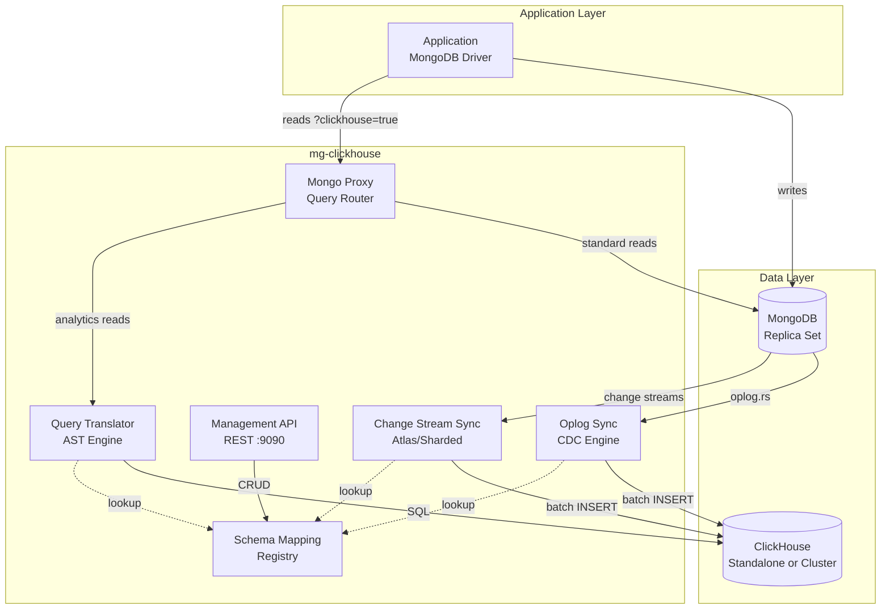

## 3. Component Design

### 3.1 Oplog Sync Engine

The core replication component. Mirrors exactly what MongoDB secondaries do internally.

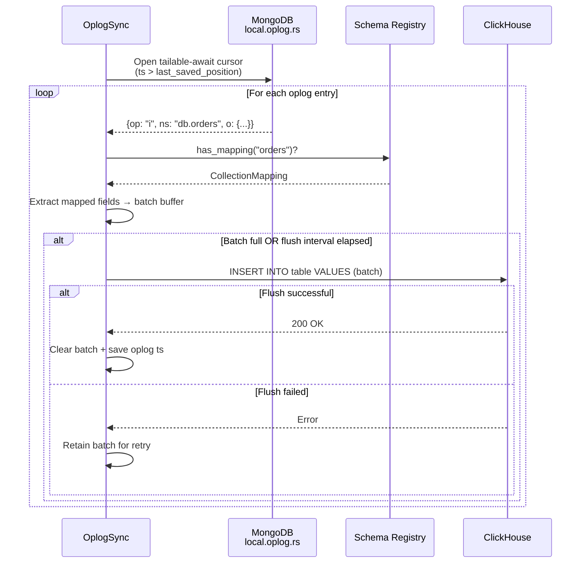

**Key design decisions:**

- Oplog position saved AFTER successful flush (prevents data loss on crash)
- Failed batches retained in memory for retry (no data discarded)
- Tailable-await cursor stays open indefinitely (same as secondary replication)
- Batch size and flush interval configurable (latency vs throughput tradeoff)
- Reconnects with 3s backoff on cursor death or MongoDB failover

### 3.2 Query Translation (Expression Tree AST)

Two-phase architecture separating parsing from SQL emission. Enables independent testing, tree-level optimizations, and multiple output targets.

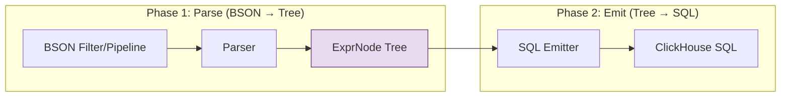

**AST Node Types:**

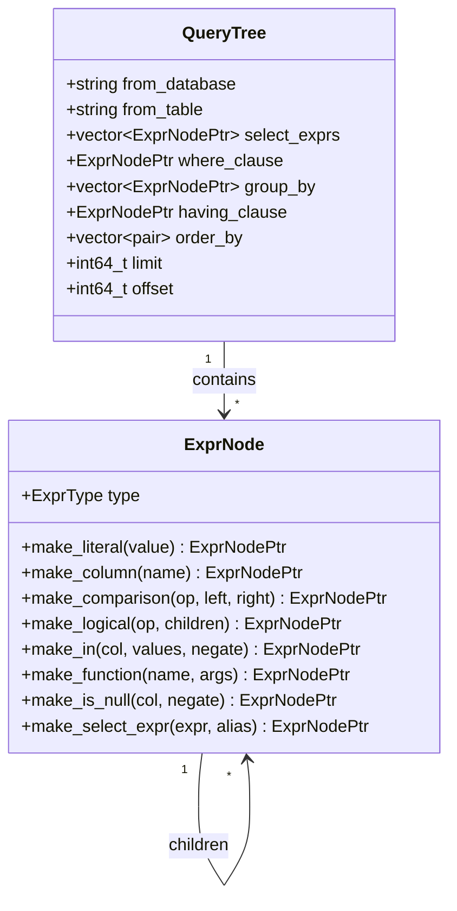

**Translation coverage:**

| MongoDB Operator | AST Node | ClickHouse SQL |
|:-----------------|:---------|:---------------|
| `{field: value}` | `Comparison(EQ)` | `` `field` = value `` |
| `{$gt, $gte, $lt, $lte, $ne}` | `Comparison(GT/GTE/LT/LTE/NE)` | `>, >=, <, <=, !=` |
| `{$in: [...]}` | `InList(negate=false)` | `IN (...)` |
| `{$nin: [...]}` | `InList(negate=true)` | `NOT IN (...)` |
| `{$and: [...]}` | `Logical(AND)` | `(...) AND (...)` |
| `{$or: [...]}` | `Logical(OR)` | `(...) OR (...)` |
| `{$nor: [...]}` | `Logical(NOT, Logical(OR))` | `NOT (... OR ...)` |
| `{$exists: true/false}` | `IsNull(negate)` | `IS NOT NULL / IS NULL` |
| `{$regex: "..."}` | `FunctionCall("match")` | `match(col, pattern)` |
| `$group._id` | `ColumnRef` in group_by | `GROUP BY col` |
| `$sum, $avg, $min, $max` | `FunctionCall` | `sum(), avg(), min(), max()` |
| `$count` | `FunctionCall("count")` | `count(*)` |

### 3.3 Schema Mapping Registry

Thread-safe in-memory registry with JSON file persistence. All access is mutex-protected.

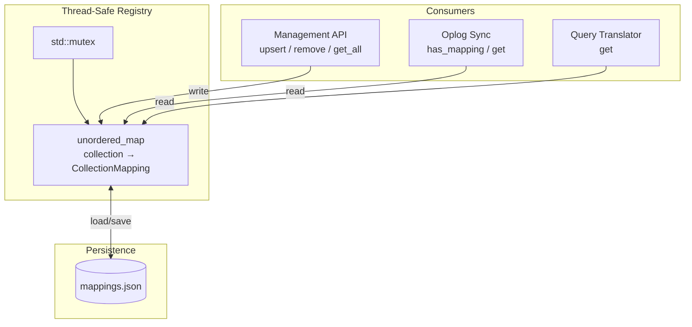

**CollectionMapping fields:**

```json
{
  "collection": "orders",
  "clickhouse_database": "analytics",
  "clickhouse_table": "orders",
  "fields": [{"mongo_field": "_id", "ch_column": "id", "ch_type": "String"}],
  "engine": "ReplacingMergeTree",
  "order_by": ["created_at", "id"],
  "cluster": "",
  "sharding_key": "",
  "enabled": true
}
```

### 3.4 Cluster Support

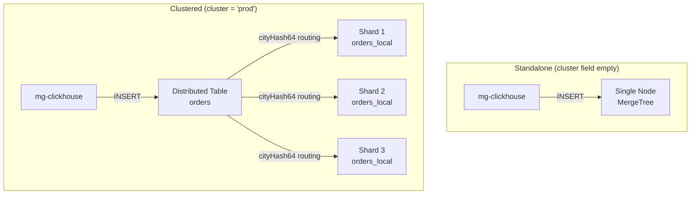

**How it works:**

When `cluster` is set in a mapping, `generate_create_table_sql()` produces two DDL statements:

1. A local MergeTree table (`_local` suffix) created `ON CLUSTER`
2. A Distributed engine table (user-facing name) that routes inserts/queries across shards

Inserts from the oplog sync go to the Distributed table. ClickHouse handles shard routing transparently based on the `sharding_key` expression.

### 3.5 Management API

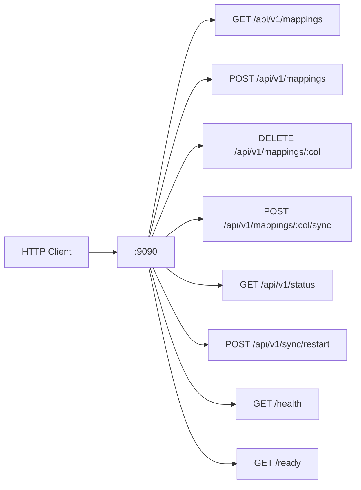

**Input validation on POST /mappings:**
- `collection` must be non-empty
- `clickhouse_table` must be non-empty
- `fields` array must be non-empty
- Each field must have non-empty `mongo_field`, `ch_column`, `ch_type`

### 3.6 Configuration Validation

Startup fails fast with clear error messages if:
- Required fields missing (`mongo.uri`, `mongo.database`, `clickhouse.host`, `clickhouse.database`)
- Port numbers out of range (1-65535)
- `batch_size` out of range (1-1,000,000)
- `flush_interval_ms` out of range (1-60,000)
- `sync.mode` not one of `oplog` or `changestream`

### 3.7 Security

- ClickHouse credentials URL-encoded (prevents injection via `&`, `=`, `?` in passwords)
- CURL handles wrapped in RAII (`CurlHandle` struct) — no leaks on exceptions
- Container runs as non-root user `mgch`
- Management API has no built-in auth — deploy behind API gateway or service mesh
- Config file should use env var substitution for secrets in production

## 4. Data Flow

### 4.1 Write Path (Zero Overhead)

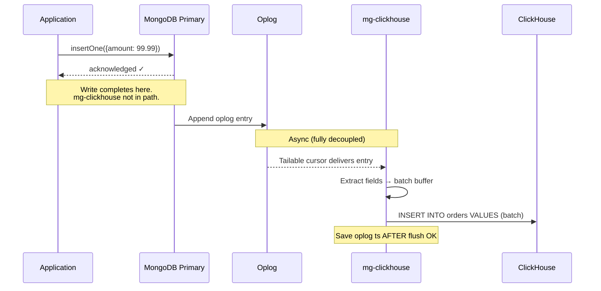

### 4.2 Read Path (Query Routing)

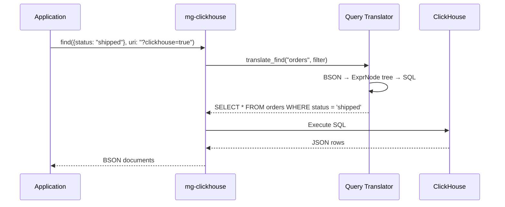

### 4.3 Crash Recovery State Machine

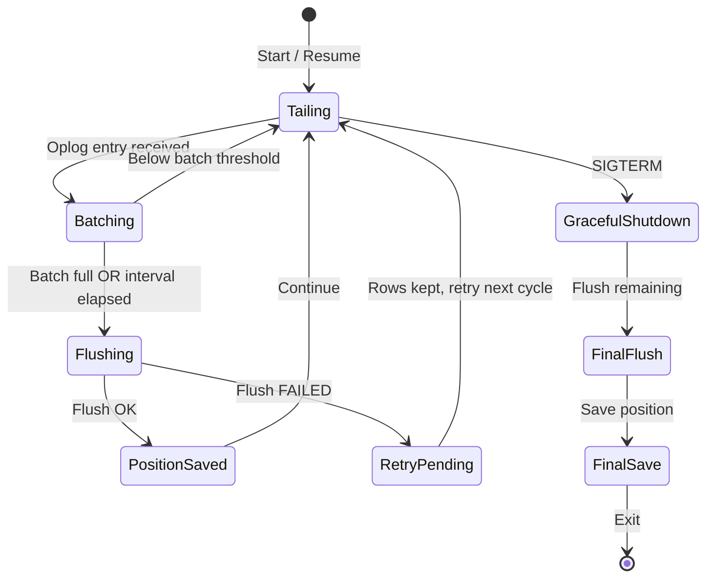

**Delivery guarantee**: At-least-once. On crash between flush and position save, the same entries replay on restart. `ReplacingMergeTree` deduplicates via the ORDER BY key.

## 5. Performance

### 5.1 Read Performance Scaling

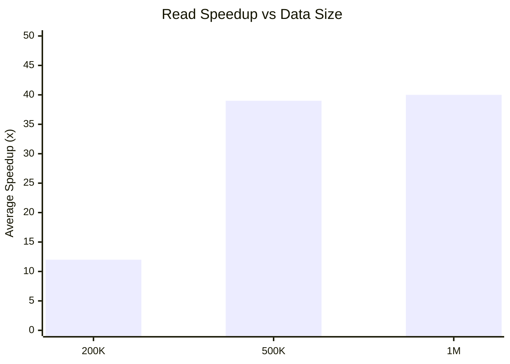

### 5.2 Standalone vs Distributed ClickHouse (500K records)

```mermaid
xychart-beta
    title "Query Latency Comparison (500K records, ms)"
    x-axis ["GROUP BY", "Avg region", "Top 10", "Filter", "Date scan", "Count", "Percentile", "uniqExact"]
    y-axis "Latency (ms)" 0 --> 1400
    bar [1329, 1351, 1077, 166, 1335, 404, 957, 1167]
    bar [14, 24, 66, 24, 33, 9, 26, 73]
    bar [36, 40, 108, 41, 70, 20, 65, 113]
```

| Query | MongoDB | Standalone CH | Distributed CH (3 shards) |
|:------|:--------|:--------------|:--------------------------|
| COUNT GROUP BY | 1,329 ms | 14 ms (95.8x) | 36 ms (37.2x) |
| AVG by region | 1,352 ms | 24 ms (55.9x) | 40 ms (34.2x) |
| Top 10 customers | 1,077 ms | 66 ms (16.3x) | 108 ms (10.0x) |
| Multi-filter | 166 ms | 24 ms (7.0x) | 41 ms (4.1x) |
| Date range scan | 1,335 ms | 34 ms (39.9x) | 70 ms (19.2x) |
| Full table count | 404 ms | 9 ms (45.5x) | 20 ms (20.1x) |
| Percentile + agg | 957 ms | 26 ms (36.6x) | 65 ms (14.8x) |
| uniqExact | 1,167 ms | 73 ms (16.1x) | 113 ms (10.3x) |

**Observations:**
- Standalone: 39.1x average speedup over MongoDB
- Distributed (3 shards): 18.7x average speedup over MongoDB
- Distributed is 1.6-2.6x slower than standalone at 500K records due to cross-shard coordination overhead
- Distributed advantage emerges at 10M+ rows per shard where parallel scan outweighs network cost

### 5.3 Write Overhead

| Metric | Standalone MongoDB | With mg-clickhouse | Overhead |
|:-------|:-------------------|:-------------------|:---------|
| Batch throughput | 28,639 docs/s | 31,858 docs/s | ~0% |
| Single insert avg | 2.67 ms | 2.60 ms | ~0% |
| Single insert P99 | 8.25 ms | 8.08 ms | ~0% |

**Confirmed zero write overhead.** The oplog tailing is fully async and decoupled from the write acknowledgment path.

## 6. Deployment

### 6.1 Single Node (Development)

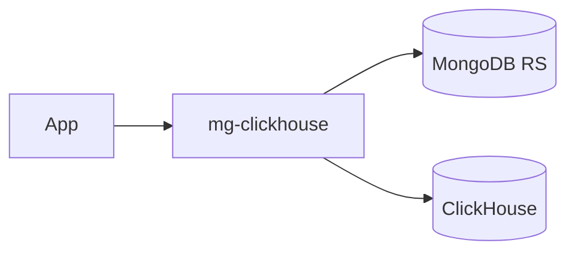

```bash
docker compose up --build
```

### 6.2 Production (Multi-Shard)

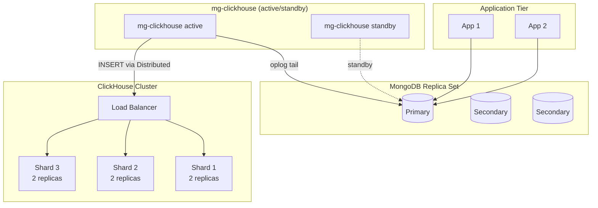

### 6.3 Kubernetes

```yaml
livenessProbe:
  httpGet: { path: /health, port: 9090 }
  initialDelaySeconds: 5
  periodSeconds: 10

readinessProbe:
  httpGet: { path: /ready, port: 9090 }
  initialDelaySeconds: 5
  periodSeconds: 5
```

Container: non-root `mgch`, `tini` PID 1, graceful shutdown on SIGTERM.

## 7. Failure Modes & Recovery

| Failure | Impact | Recovery | Data Loss |
|:--------|:-------|:---------|:----------|
| mg-clickhouse crash | Replication pauses | Resume from saved oplog position | None (at-least-once) |
| ClickHouse down | Batches accumulate | Retry on next flush; position not advanced | None |
| MongoDB failover | Cursor dies | Reconnect with 3s backoff | None |
| Network partition (MG↔CH) | Flush failures | Rows retained, retried | None |
| Corrupted resume token | Cannot resume exactly | Start from oplog tail | Possible gap during downtime |
| OOM (unbounded batch) | Process killed | Resume from last position | Batch in flight lost, replayed |

## 8. Limitations & Roadmap

| Current Limitation | Planned Solution | Priority |
|:-------------------|:-----------------|:---------|
| Single instance (no HA) | Leader election via MongoDB advisory locks | High |
| No initial bulk sync | Full collection scan on first deploy | High |
| Partial updates not synced | Document re-fetch from MongoDB | Medium |
| No metrics export | Prometheus /metrics endpoint | Medium |
| No API authentication | JWT or mTLS | Medium |
| Deletes not propagated | Soft-delete column + TTL | Low |
| No backpressure on batch growth | Memory-bounded queue with disk spill | Low |

## 9. Technology Stack

| Component | Technology | Rationale |
|:----------|:-----------|:----------|
| Language | C++17 | Low latency, zero-copy BSON, deterministic resource management |
| MongoDB driver | mongocxx 3.9 | Official driver, tailable cursor support |
| ClickHouse protocol | HTTP via libcurl | Universal compatibility, works with any deployment |
| HTTP server | cpp-httplib 0.15 | Header-only, lightweight |
| Config | yaml-cpp 0.8 | Human-readable, standard for infra tools |
| JSON | nlohmann/json 3.11 | Header-only, industry standard |
| Container | Ubuntu 22.04 + tini | Stable base, proper signal handling |
| Build | CMake 3.16 + FetchContent | Reproducible builds, auto-fetches header-only deps |

## 10. File Structure

```
mg-clickhouse/
├── include/mg_clickhouse/
│   ├── config.h              # Config structs + validation
│   ├── schema_mapping.h      # Registry + DDL generation
│   ├── expr_tree.h           # AST node types + emit_sql/emit_query
│   ├── query_translator.h    # BSON → ExprTree → SQL
│   ├── clickhouse_client.h   # HTTP client (RAII CURL)
│   ├── oplog_sync.h          # Oplog CDC engine
│   ├── change_stream_sync.h  # Change stream CDC
│   ├── mongo_proxy.h         # Read routing
│   ├── management_api.h      # REST API
│   └── routing.h             # URI parsing
├── src/                      # Implementations
├── config/                   # Example YAML configs
├── benchmark/                # Performance tools
│   ├── read_benchmark.py
│   ├── write_benchmark.py
│   ├── distributed_benchmark.py
│   └── docker-compose-cluster.yml
├── docs/                     # Design documents
├── CMakeLists.txt
├── Dockerfile                # Multi-stage production image
└── docker-compose.yml        # Dev stack (Mongo + CH + mg-clickhouse)
```
