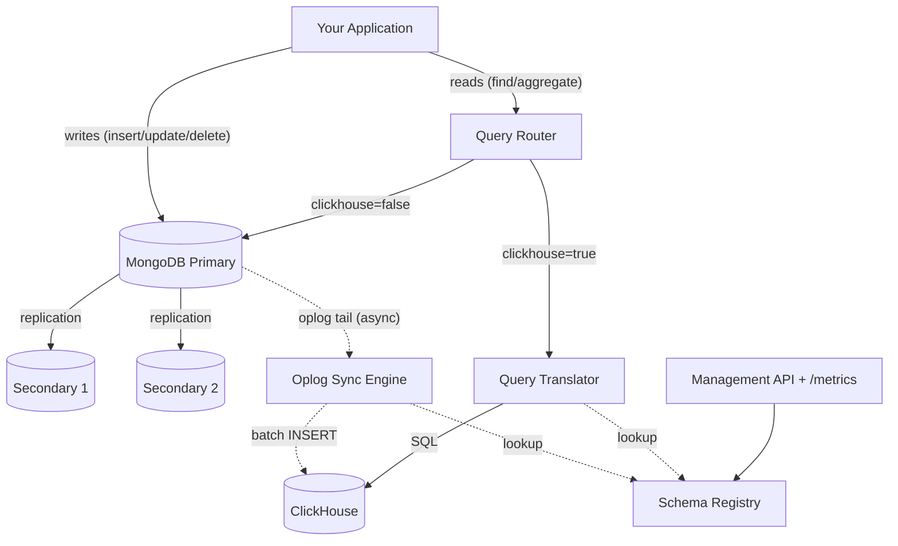
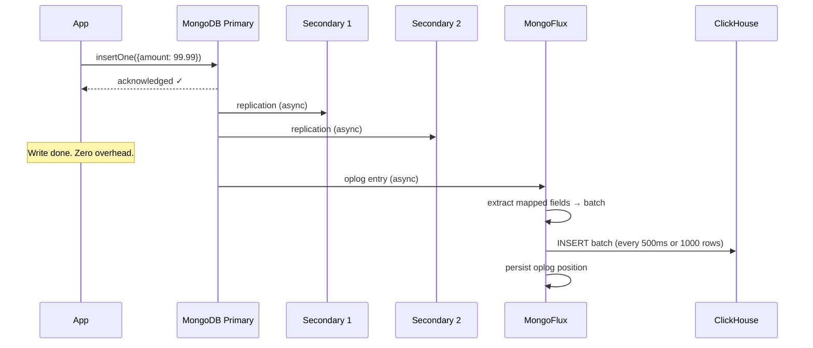
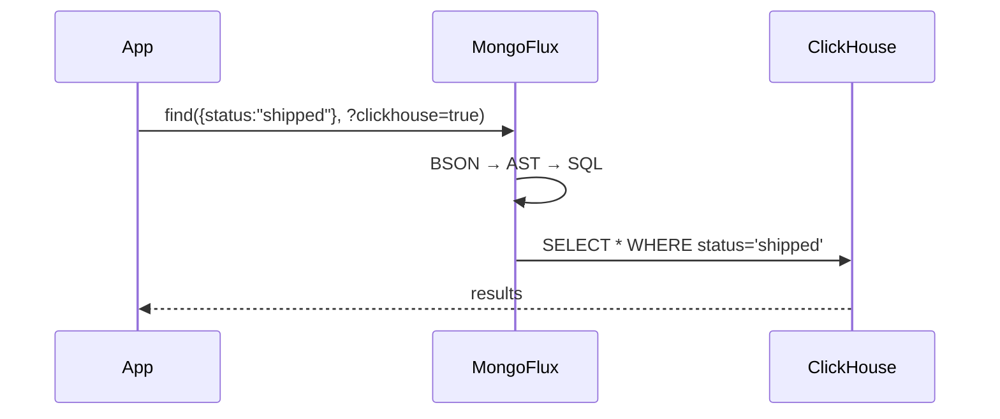
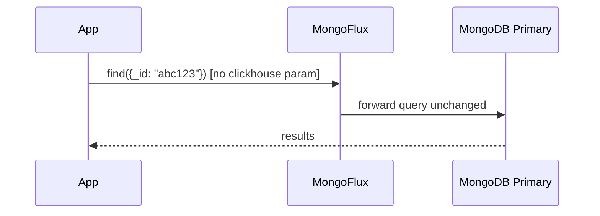
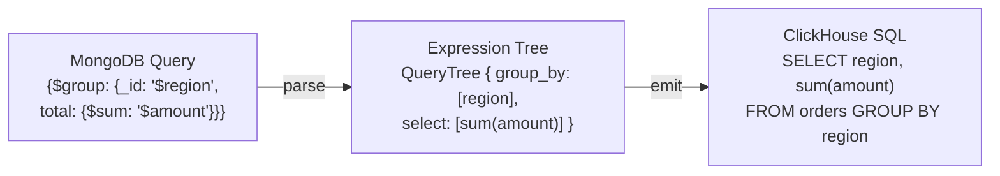
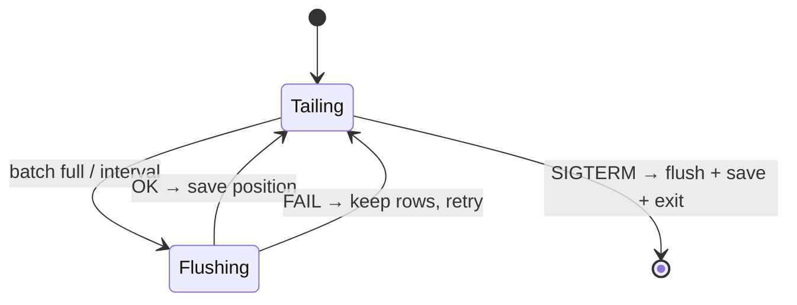
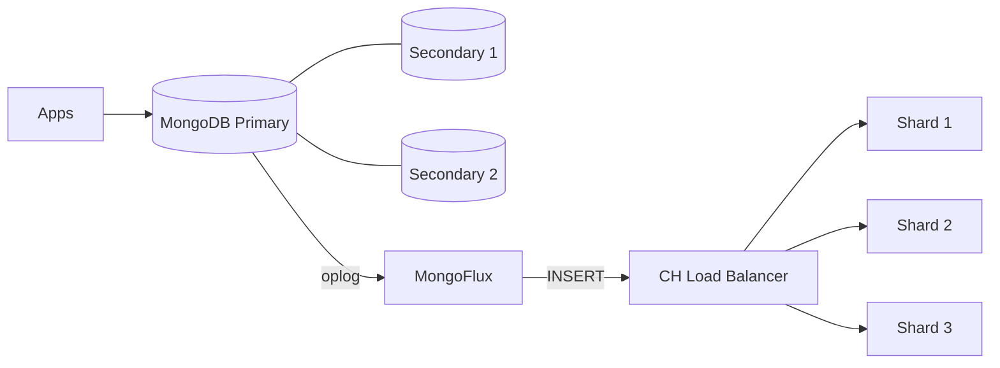

# MongoFlux — Design & Architecture


**v1.2** | 2026-05-15 | Production

---

## The Problem We Solved

MongoDB is great for OLTP. Point lookups, single-doc writes, transactions — all fast. But the moment you need analytics (GROUP BY over millions of rows, time-range scans, percentiles), it falls apart. You end up building ETL pipelines, maintaining a separate warehouse, dealing with stale data. And the classic workaround — reading from one system, writing to another — means your application code splits into two paths, two connection strings, two query languages.

MongoFlux eliminates all of that. Your app talks to one place for both reads and writes. No code changes, no query rewrites. Internally, MongoFlux tails the oplog in real-time (exactly like a secondary node does), replicates to ClickHouse, and routes analytical queries there transparently. You just set `?clickhouse=true` once in your read connection string and everything else stays the same — same `find()`, same `aggregate()`, same MongoDB query syntax.

| | OLTP (MongoDB) | OLAP (ClickHouse) |
|:--|:---------------|:-------------------|
| Storage layout | Row-oriented (full documents) | Column-oriented (only needed columns scanned) |
| Compression | ~2x | ~10-20x (columnar + codecs) |
| GROUP BY 500K rows | 300-1500 ms | 8-30 ms |
| Best at | Point lookups, writes, transactions | Aggregations, scans, GROUP BY |

**Goals**: Zero write overhead, sub-second replication, no app code changes, standalone + clustered ClickHouse support.

**Non-goals**: Full wire protocol proxy, real-time deletes with strong consistency, multi-tenancy.

---

## Architecture

MongoDB runs as a 3-node replica set (1 primary + 2 secondaries). The application connects to MongoFlux for reads. If the connection URI contains `?clickhouse=true`, MongoFlux translates the query to SQL and sends it to ClickHouse. Otherwise it forwards to MongoDB unchanged. Writes go directly to the primary. MongoFlux tails the oplog asynchronously to replicate data to ClickHouse — making ClickHouse behave like a "virtual secondary."



---

## Data Flow

### Write Path (zero overhead)

Writes target the MongoDB primary. The two secondaries replicate via the standard MongoDB protocol. MongoFlux tails the primary's oplog independently — it is not in the write path at all.



The primary acknowledges writes to your application before MongoFlux even sees them. If the primary fails, the replica set elects a new primary and MongoFlux automatically reconnects.

### Read Path (query routing)

The application sends all reads to MongoFlux. Same interface for everything — no split paths, no code changes.





### Schema Mapping (What Gets Synced)

You define which MongoDB fields map to ClickHouse columns via a REST API. Only mapped fields are synced — your 50-field documents become lean 5-column analytical tables.

```bash
curl -X POST http://localhost:9090/api/v1/mappings -d '{
  "collection": "orders",
  "clickhouse_table": "orders",
  "clickhouse_database": "analytics",
  "fields": [
    {"mongo_field": "_id", "ch_column": "id", "ch_type": "String"},
    {"mongo_field": "amount", "ch_column": "amount", "ch_type": "Float64"},
    {"mongo_field": "region", "ch_column": "region", "ch_type": "LowCardinality(String)"}
  ],
  "engine": "ReplacingMergeTree",
  "order_by": ["region", "id"]
}'
```

---

## Components

### Oplog Sync

Tails `local.oplog.rs` with a tailable-await cursor — same mechanism MongoDB secondaries use.

- Position saved AFTER successful flush (at-least-once delivery)
- Failed batches retained for retry (no data loss)
- Reconnects with 3s backoff on cursor death
- Configurable: `batch_size` (throughput) and `flush_interval_ms` (latency)
- Backpressure: blocks when `max_pending_rows` exceeded
- Optional delete propagation via tombstone rows

### Change Stream Sync (Atlas/Sharded)

Alternative to oplog sync for environments without direct oplog access. Uses MongoDB change streams API. Per-collection threads with resume token persistence.

### Query Translator (AST)

Two-phase translation: Parse BSON → ExprNode tree → Emit ClickHouse SQL.



Supports:
- **Stages**: `$match`, `$group`, `$sort`, `$limit`, `$skip`, `$project`, `$addFields`, `$set`, `$unwind`, `$count`, `$sample`
- **Operators**: `$gt`, `$gte`, `$lt`, `$lte`, `$eq`, `$ne`, `$in`, `$nin`, `$and`, `$or`, `$nor`, `$exists`, `$regex`
- **Accumulators**: `$sum`, `$avg`, `$min`, `$max`, `$count`, `$first`, `$last`, `$push`, `$addToSet`, `$stdDevPop`, `$stdDevSamp`
- **Expressions**: arithmetic (`$add`, `$multiply`, `$subtract`, `$divide`, `$mod`, `$abs`, `$ceil`, `$floor`, `$round`, `$sqrt`, `$pow`), string (`$concat`, `$toUpper`, `$toLower`, `$trim`, `$substr`, `$split`, `$regexMatch`), date (`$year`, `$month`, `$dayOfMonth`, `$dayOfWeek`, `$dayOfYear`), conditional (`$cond`)

### Schema Registry

Thread-safe `unordered_map<collection, CollectionMapping>` with mutex. Persisted to `mappings.json`. Shared by sync engine, translator, and management API.

### Cluster Support

| Mode | Config | What happens |
|:-----|:-------|:-------------|
| Standalone | No `cluster` field | Single MergeTree table |
| Clustered | `"cluster": "prod"` | Local table + Distributed table (auto-routes inserts to shards) |

### Shared Utilities (`bson_utils.h`)

Three functions eliminate code duplication between oplog sync and change stream sync:

- `extract_mapped_fields()` — BSON doc → JSON row
- `escape_ch_string()` — SQL string literal escaping
- `prepare_batch_for_insert()` — JSON batch → columns + values for INSERT

---

## Crash Recovery



The critical design decision: oplog position is saved only AFTER a successful flush to ClickHouse. If MongoFlux crashes between flush and save, the same entries replay on restart. `ReplacingMergeTree` deduplicates the replays automatically. At-least-once delivery guaranteed.

---

## Performance

### Read Benchmarks (500K records)

```mermaid
xychart-beta
    title "MongoDB vs ClickHouse Latency (ms)"
    x-axis ["Count", "Revenue", "Top 10", "Monthly", "2D Group", "Filter+Agg", "Percentile", "Dashboard"]
    y-axis "Latency (ms)" 0 --> 750
    bar [313, 281, 520, 335, 365, 287, 312, 394]
    bar [8, 10, 34, 11, 13, 10, 14, 12]
```



| Query | MongoDB | Standalone CH | Distributed CH (3 shards) |
|:------|:--------|:--------------|:--------------------------|
| GROUP BY count | 823 ms | 17 ms (50x) | 61 ms (13x) |
| Avg by region | 886 ms | 22 ms (41x) | 44 ms (20x) |
| Top 10 customers | 1,097 ms | 89 ms (12x) | 178 ms (6x) |
| Date range scan | 1,492 ms | 78 ms (19x) | 63 ms (24x) |
| Full count | 448 ms | 12 ms (38x) | 37 ms (12x) |
| Percentile + agg | 1,206 ms | 23 ms (53x) | 58 ms (21x) |

Standalone avg: **26.5x** | Distributed avg: **12.3x** | Distributed wins on large parallel scans (date range: 24x vs 19x).

The speedup scales superlinearly with data size: 12x at 200K → 27x at 500K → 40x at 1M records.

### Write Overhead: Zero

| Metric | MongoDB alone | With MongoFlux | Overhead |
|:-------|:-------------|:---------------|:---------|
| Batch throughput | 28,639 docs/s | 31,858 docs/s | **0%** |
| Single insert P99 | 8.25 ms | 8.08 ms | **0%** |

The oplog tailing is completely invisible to your write path.

### Standalone vs Distributed

| Mode | When to use | Avg speedup |
|:-----|:------------|:------------|
| Standalone | Data fits on one node (<500GB) | 26.5x |
| Distributed (3 shards) | Horizontal scaling needed | 12.3x |

Distributed is slower at small data sizes due to cross-shard coordination overhead. It wins at 10M+ rows per shard where parallel scan outweighs network cost.

---

## Configuration

```yaml
mongo:
  uri: "mongodb://mongo-primary:27017,mongo-secondary1:27017,mongo-secondary2:27017/?replicaSet=rs0"
  database: "myapp"

clickhouse:
  host: "localhost"
  port: 8123
  database: "analytics"
  user: "default"
  password: ""
  cluster: ""              # empty = standalone

sync:
  mode: "oplog"            # or "changestream"
  batch_size: 1000
  flush_interval_ms: 500
  resume_token_path: "/var/lib/mongoflux/resume_tokens"
  max_pending_rows: 100000
  propagate_deletes: false
  delete_column: "_deleted"

api:
  port: 9090
  bind: "0.0.0.0"

routing:
  clickhouse_param: "clickhouse"

logging:
  level: "info"
  file: ""
```

Validated at startup: required fields, port ranges (1-65535), batch_size (1-1M), flush_interval (1-60000), mode must be `oplog` or `changestream`.

| Sync mode | When to use | Requires |
|:----------|:------------|:---------|
| `oplog` | Direct replica set access, lowest latency | `local.oplog.rs` access |
| `changestream` | Atlas, sharded clusters | MongoDB 4.0+ |

---

## Deployment

The default deployment uses a 3-node MongoDB replica set (`rs0`) with 1 primary and 2 secondaries. MongoFlux connects using the full replica set URI and automatically follows primary elections.



| Aspect | Detail |
|:-------|:-------|
| MongoDB | 3-node replica set with auto `rs.initiate()` |
| Container | Non-root `mongoflux`, `tini` PID 1, graceful shutdown |
| K8s probes | `/health` (liveness), `/ready` (checks CH) |
| Metrics | `/metrics` (Prometheus format) |
| Security | RAII CURL, URL-encoded creds, deploy API behind gateway |

---

## Production Features

- **Prometheus metrics** (`/metrics`) — rows synced, flush latency, oplog lag, pending buffer size
- **Memory backpressure** — configurable max pending rows prevents OOM when ClickHouse is down
- **Delete propagation** — optional tombstone rows for soft-delete tracking
- **Config validation** — fails fast on startup with clear error messages
- **Graceful shutdown** — flushes pending batches and persists position on SIGTERM
- **Kubernetes-ready** — `/health` and `/ready` probes, non-root container, tini PID 1

---

## Failure Modes

| Failure | Recovery | Data Loss |
|:--------|:---------|:----------|
| MongoFlux crash | Resume from saved position | None |
| ClickHouse down | Retry on next flush | None |
| MongoDB primary failover | Auto-discovers new primary via replica set URI (3s backoff) | None |
| MongoDB secondary down | No impact — MongoFlux tails primary only | None |
| Corrupted token | Start from oplog tail | Possible gap |

---

## Getting Started (5 Minutes)

```bash
git clone https://github.com/your-org/MongoFlux
cd MongoFlux
docker compose up --build
```

This starts a 3-node MongoDB replica set (1 primary + 2 secondaries on ports 27017-27019), ClickHouse, and MongoFlux. The replica set initializes automatically. Create a mapping, insert data into MongoDB, and query it from ClickHouse — all within 5 minutes.

---

## When Should You Use This?

**Good fit:**
- You have MongoDB in production and need faster analytics/dashboards
- Your aggregation pipelines are slow (>100ms) on collections with 100K+ documents
- You want real-time analytics without ETL pipeline complexity
- You're building observability/logging on MongoDB but need ClickHouse query speed

**Not a fit:**
- You need sub-millisecond replication (MongoFlux batches at 500ms intervals)
- Your queries are simple point lookups (MongoDB is already fast for these)
- You need real-time delete propagation with strong consistency

---

## Roadmap

| Item | Priority |
|:-----|:---------|
| HA via leader election | High |
| Initial bulk sync | High |
| Partial update support ($set) | Medium |
| API authentication (JWT/mTLS) | Medium |
| Wire protocol proxy (full MongoDB compatibility) | Low |

---

## File Structure

```
include/mongoflux/
  config.h, schema_mapping.h, expr_tree.h, query_translator.h,
  clickhouse_client.h, oplog_sync.h, change_stream_sync.h,
  mongo_proxy.h, management_api.h, routing.h, bson_utils.h, metrics.h

src/
  main.cpp, config.cpp, schema_mapping.cpp, expr_tree.cpp,
  query_translator.cpp, clickhouse_client.cpp, oplog_sync.cpp,
  change_stream_sync.cpp, mongo_proxy.cpp, management_api.cpp, routing.cpp

benchmark/
  read_benchmark.py, write_benchmark.py, distributed_benchmark.py,
  breakeven_benchmark.py, aggregation_benchmark.py, real_data_benchmark.py

test-app/
  test_mongoflux.py
```

---

*MongoFlux is Apache-2.0 licensed. Built with C++17, mongocxx 3.9, libcurl, cpp-httplib, and nlohmann/json.*
