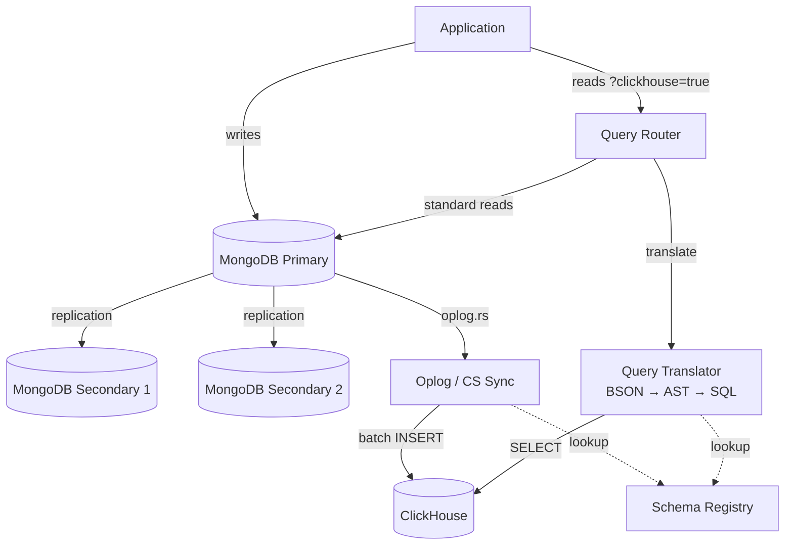
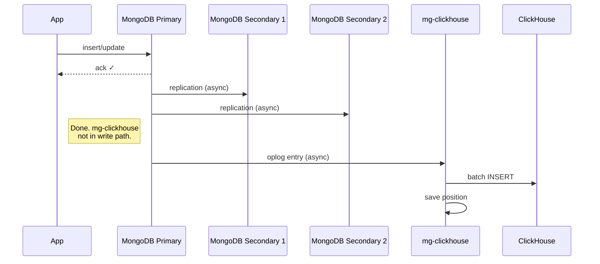
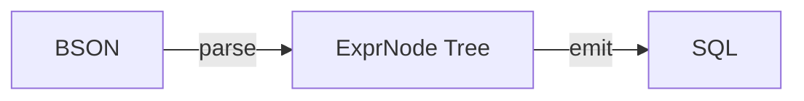
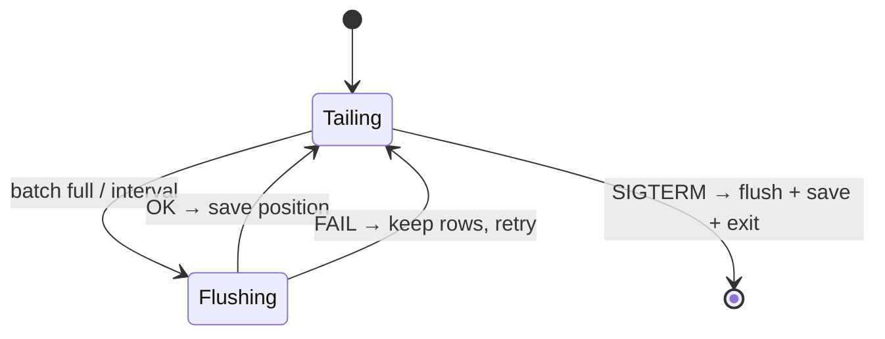
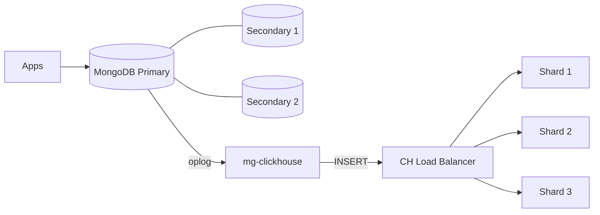

# mg-clickhouse — Design Document

**v1.2** | 2026-05-15 | Production

## 1. What It Does

mg-clickhouse replicates MongoDB to ClickHouse in real-time using oplog tailing (same as MongoDB secondaries), and routes analytical reads to ClickHouse transparently via a single URI parameter.

**Goals**: Zero write overhead, sub-second replication, no app code changes, standalone + clustered ClickHouse.

**Non-goals**: Full wire protocol proxy, real-time deletes, multi-tenancy.

## 2. Architecture

MongoDB runs as a 3-node replica set (1 primary + 2 secondaries). mg-clickhouse tails the oplog from the primary and automatically reconnects to the new primary after a failover election.



## 3. Data Flow

### Writes (zero overhead)

Writes target the MongoDB primary. The two secondaries replicate via the standard MongoDB replication protocol. mg-clickhouse tails the primary's oplog independently.



### Reads (query routing)


## 4. Components

### 4.1 Oplog Sync

Tails `local.oplog.rs` with a tailable-await cursor. Same mechanism MongoDB secondaries use.

- Position saved AFTER successful flush (at-least-once delivery)
- Failed batches retained for retry (no data loss)
- Reconnects with 3s backoff on cursor death
- Configurable: `batch_size` (throughput) and `flush_interval_ms` (latency)

### 4.2 Query Translator (AST)

Two-phase: Parse BSON → ExprNode tree → Emit ClickHouse SQL.



Supports: `find()`, `aggregate($match, $group, $sort, $limit, $project, $count)`, operators `$gt/$lt/$in/$or/$regex/$exists`.

### 4.3 Schema Registry

Thread-safe `unordered_map<collection, CollectionMapping>` with mutex. Persisted to `mappings.json`. Shared by sync engine, translator, and API.

### 4.4 Cluster Support

| Mode | Config | What happens |
|:-----|:-------|:-------------|
| Standalone | No `cluster` field | Single MergeTree table |
| Clustered | `"cluster": "prod"` | Local table + Distributed table (auto-routes inserts to shards) |

### 4.5 Shared Utilities (`bson_utils.h`)

Three functions eliminate all code duplication between oplog sync and change stream sync:

- `extract_mapped_fields()` — BSON doc → JSON row
- `escape_ch_string()` — SQL string literal escaping
- `prepare_batch_for_insert()` — JSON batch → columns + values for INSERT

## 5. Crash Recovery



Position saved only after successful flush. Crash before save → replay from last position. `ReplacingMergeTree` deduplicates replays.

## 6. Performance

### Reads (500K records)

| Query | MongoDB | Standalone CH | Distributed CH (3 shards) |
|:------|:--------|:--------------|:--------------------------|
| GROUP BY count | 823 ms | 17 ms (50x) | 61 ms (13x) |
| Avg by region | 886 ms | 22 ms (41x) | 44 ms (20x) |
| Top 10 customers | 1,097 ms | 89 ms (12x) | 178 ms (6x) |
| Date range scan | 1,492 ms | 78 ms (19x) | 63 ms (24x) |
| Full count | 448 ms | 12 ms (38x) | 37 ms (12x) |
| Percentile + agg | 1,206 ms | 23 ms (53x) | 58 ms (21x) |

Standalone avg: **26.5x** | Distributed avg: **12.3x** | Distributed wins on large parallel scans.

### Writes (200K records)

| Metric | MongoDB alone | With mg-clickhouse | Overhead |
|:-------|:-------------|:-------------------|:---------|
| Batch throughput | 28,639 docs/s | 31,858 docs/s | **0%** |
| Single insert P99 | 8.25 ms | 8.08 ms | **0%** |

## 7. Configuration

```yaml
mongo:
  uri: "mongodb://mongo-primary:27017,mongo-secondary1:27017,mongo-secondary2:27017/?replicaSet=rs0"
  database: "myapp"

clickhouse:
  host: "localhost"
  port: 8123
  database: "analytics"
  user: "default"
  password: ""
  cluster: ""              # empty = standalone

sync:
  mode: "oplog"            # or "changestream"
  batch_size: 1000
  flush_interval_ms: 500
  resume_token_path: "/var/lib/mg-clickhouse/resume_tokens"

api:
  port: 9090
  bind: "0.0.0.0"

routing:
  clickhouse_param: "clickhouse"
```

Validated at startup: required fields, port ranges (1-65535), batch_size (1-1M), flush_interval (1-60000), mode must be `oplog` or `changestream`.

## 8. Deployment

The default deployment uses a 3-node MongoDB replica set (`rs0`) with 1 primary and 2 secondaries. mg-clickhouse connects using the full replica set URI and automatically follows primary elections.



- Docker: non-root `mgch`, `tini` PID 1, graceful shutdown
- Docker Compose: 3 MongoDB nodes (`mongo-primary`, `mongo-secondary1`, `mongo-secondary2`) with automatic `rs.initiate()`
- K8s: `/health` (liveness), `/ready` (readiness, checks CH)
- Security: RAII CURL, URL-encoded credentials, no built-in API auth (use gateway)

## 9. Failure Modes

| Failure | Recovery | Data Loss |
|:--------|:---------|:----------|
| mg-clickhouse crash | Resume from saved position | None |
| ClickHouse down | Retry on next flush | None |
| MongoDB primary failover | Driver auto-discovers new primary via replica set URI (3s backoff) | None |
| MongoDB secondary down | No impact — mg-clickhouse tails primary only | None |
| Corrupted token | Start from oplog tail | Possible gap |

## 10. Roadmap

| Item | Priority |
|:-----|:---------|
| HA via leader election | High |
| Initial bulk sync | High |
| Partial update support ($set) | Medium |
| Prometheus metrics | Medium |
| API authentication (JWT/mTLS) | Medium |
| Soft-delete propagation | Low |

## 11. File Structure

```
include/mg_clickhouse/
  config.h, schema_mapping.h, expr_tree.h, query_translator.h,
  clickhouse_client.h, oplog_sync.h, change_stream_sync.h,
  mongo_proxy.h, management_api.h, routing.h, bson_utils.h

src/
  main.cpp, config.cpp, schema_mapping.cpp, expr_tree.cpp,
  query_translator.cpp, clickhouse_client.cpp, oplog_sync.cpp,
  change_stream_sync.cpp, mongo_proxy.cpp, management_api.cpp, routing.cpp

benchmark/
  read_benchmark.py, write_benchmark.py, distributed_benchmark.py
```
