# mg-clickhouse — Design Document

## 1. Overview

mg-clickhouse is a real-time CDC (Change Data Capture) bridge between MongoDB and ClickHouse. It replicates data from MongoDB to ClickHouse using the same oplog tailing mechanism that MongoDB secondaries use, and transparently routes analytical read queries to ClickHouse via MongoDB-compatible query translation.

### Design Goals

- Zero write overhead on MongoDB (async oplog tailing, fully decoupled from write path)
- Sub-second replication latency (same as MongoDB secondary nodes)
- Transparent query routing (single URI parameter switches reads to ClickHouse)
- Support both standalone and multi-shard ClickHouse deployments
- Crash recovery with at-least-once delivery semantics
- No application code changes required

## 2. Architecture

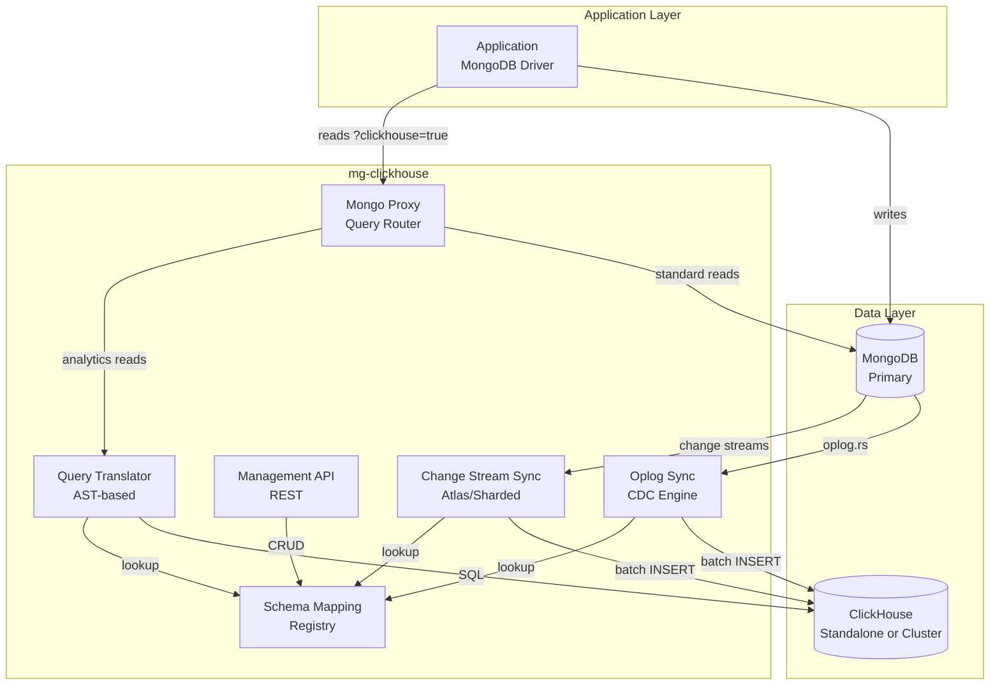

## 3. Component Design

### 3.1 Oplog Sync Engine

The core replication component. Mirrors exactly what MongoDB secondaries do internally.

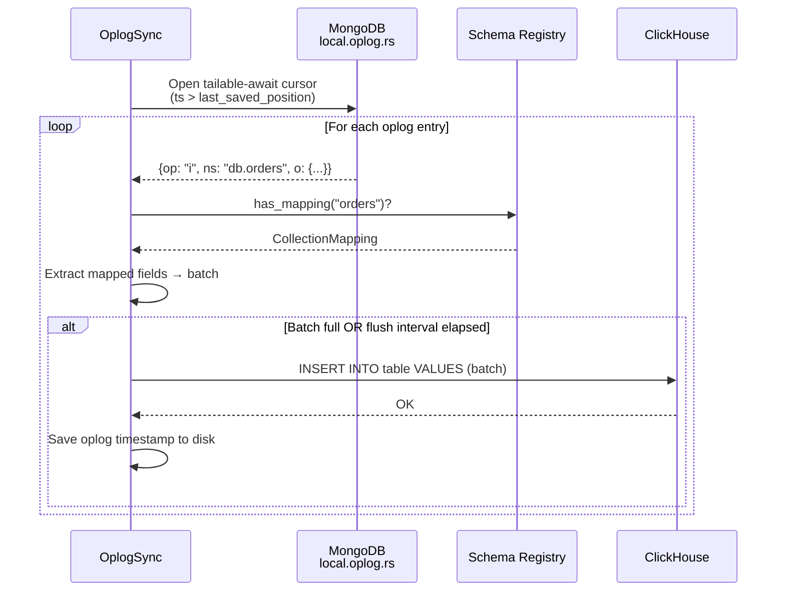

**Key design decisions:**

- Oplog position saved AFTER successful flush (not before) to prevent data loss on crash
- Failed batches retained in memory for retry on next flush cycle
- Tailable-await cursor stays open indefinitely (same as secondary replication)
- Batch size and flush interval are configurable for latency vs throughput tradeoff

### 3.2 Query Translation (Expression Tree AST)

Two-phase architecture separating parsing from SQL emission.

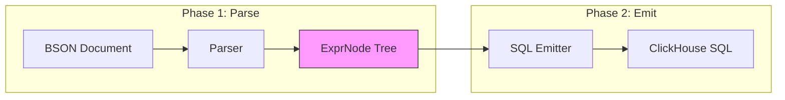

**AST Node Types:**

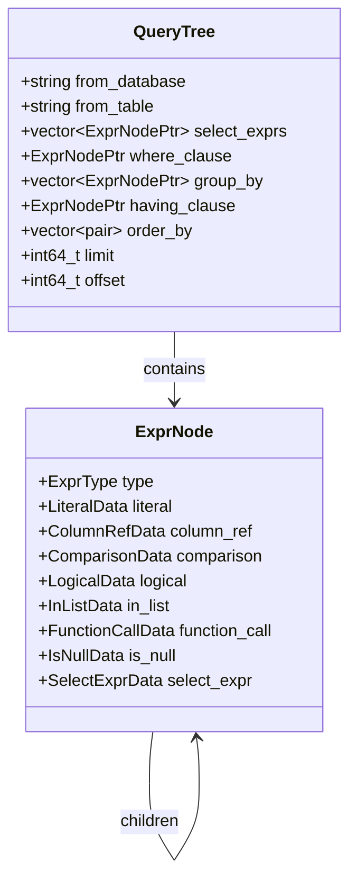

**Translation examples:**

| MongoDB | ExprNode Tree | ClickHouse SQL |
|:--------|:--------------|:---------------|
| `{status: "shipped"}` | `Comparison(EQ, Column("status"), Literal("shipped"))` | `` `status` = 'shipped' `` |
| `{amount: {$gt: 100, $lt: 500}}` | `Logical(AND, [Comp(GT, ...), Comp(LT, ...)])` | `` `amount` > 100 AND `amount` < 500 `` |
| `{$or: [{a: 1}, {b: 2}]}` | `Logical(OR, [Comp(EQ, ...), Comp(EQ, ...)])` | `(a = 1) OR (b = 2)` |

### 3.3 Schema Mapping Registry

Thread-safe in-memory registry with file persistence.

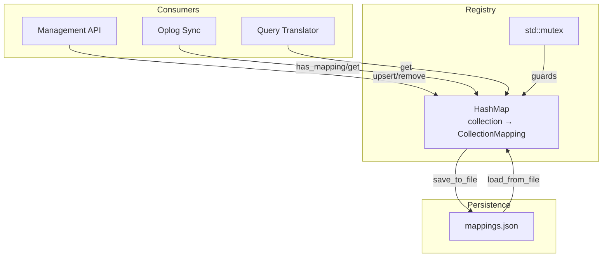

### 3.4 Cluster Support (Standalone + Multi-Shard)

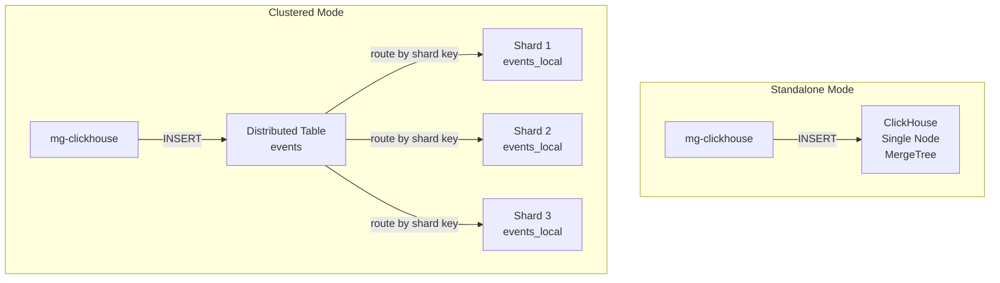

**DDL generation for clustered deployments:**

```sql
-- Step 1: Local table on each shard (via ON CLUSTER distributed DDL)
CREATE TABLE analytics.events_local ON CLUSTER 'prod-cluster' (
    event_id String,
    user_id String,
    ts DateTime
) ENGINE = ReplacingMergeTree()
ORDER BY (ts, event_id);

-- Step 2: Distributed table for routing
CREATE TABLE analytics.events ON CLUSTER 'prod-cluster'
AS analytics.events_local
ENGINE = Distributed('prod-cluster', 'analytics', 'events_local', cityHash64(user_id));
```

### 3.5 Management API

```mermaid
graph LR
    CLIENT[HTTP Client] --> API[Management API :9090]
    API --> MAPPINGS[/api/v1/mappings]
    API --> STATUS[/api/v1/status]
    API --> SYNC[/api/v1/sync/restart]
    API --> HEALTH[/health]
    API --> READY[/ready]

    MAPPINGS --> REGISTRY[Schema Registry]
    SYNC --> OPLOG[Oplog Sync]
    SYNC --> CS[Change Stream Sync]
    READY --> CH[ClickHouse Ping]
```

## 4. Data Flow

### 4.1 Write Path (Zero Overhead)

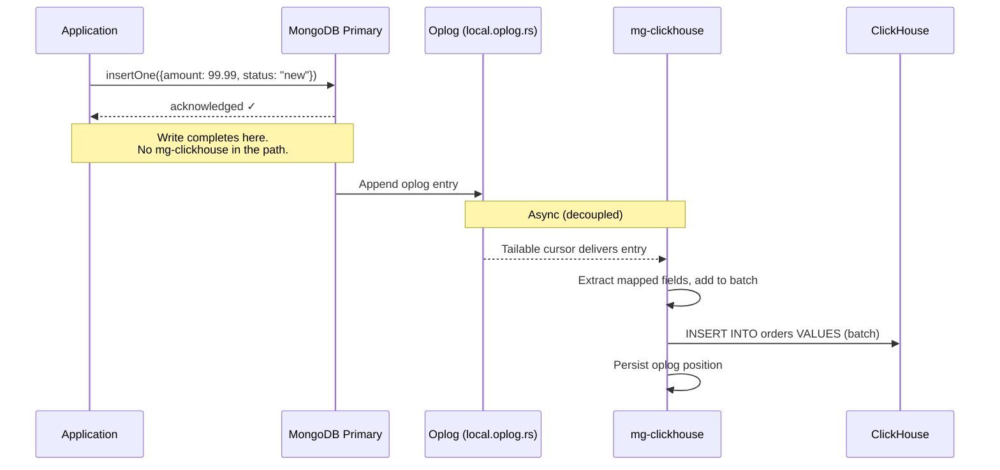

### 4.2 Read Path (Query Routing)

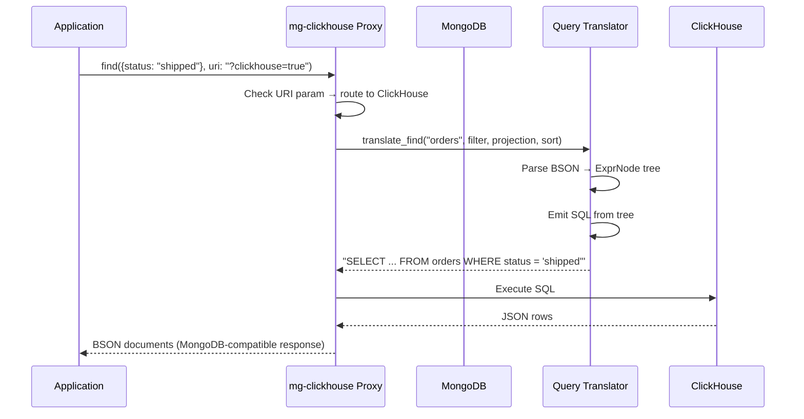

### 4.3 Crash Recovery

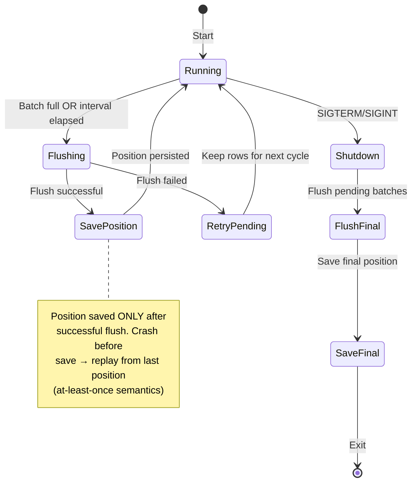

## 5. Configuration

### 5.1 Standalone ClickHouse

```yaml
clickhouse:
  host: "clickhouse-node-1"
  port: 8123
  database: "analytics"
  user: "default"
  password: ""
```

### 5.2 Multi-Shard ClickHouse

```yaml
clickhouse:
  host: "clickhouse-lb"       # Load balancer or any node
  port: 8123
  database: "analytics"
  user: "default"
  password: ""
  cluster: "prod-cluster"     # Enables ON CLUSTER DDL
```

Per-mapping cluster override:

```json
{
  "collection": "events",
  "clickhouse_table": "events",
  "clickhouse_database": "analytics",
  "cluster": "prod-cluster",
  "sharding_key": "cityHash64(user_id)",
  "engine": "ReplacingMergeTree",
  "order_by": ["ts", "event_id"]
}
```

## 6. Performance Characteristics

### 6.1 Read Performance (1M records)

```mermaid
xychart-beta
    title "Query Latency: MongoDB vs ClickHouse (1M records)"
    x-axis ["GROUP BY", "Avg by region", "Top 10", "Date range", "2-dim GROUP", "Full count"]
    y-axis "Latency (ms)" 0 --> 1000
    bar [506, 558, 855, 973, 628, 262]
    bar [10, 9, 40, 16, 14, 3]
```

| Metric | Value |
|:-------|:------|
| Average read speedup | 39.9x at 1M records |
| Peak speedup | 84.1x (full table count) |
| Scaling pattern | Superlinear (12x at 200K → 40x at 1M) |

### 6.2 Write Overhead

| Metric | Standalone MongoDB | With mg-clickhouse | Overhead |
|:-------|:-------------------|:-------------------|:---------|
| Batch throughput | 28,639 docs/s | 31,858 docs/s | ~0% |
| Single insert P50 | 2.50 ms | 2.43 ms | ~0% |
| Single insert P99 | 8.25 ms | 8.08 ms | ~0% |

**Zero write overhead** — confirmed by benchmark. The oplog tailing is fully async.

## 7. Deployment Topology

### 7.1 Single Node

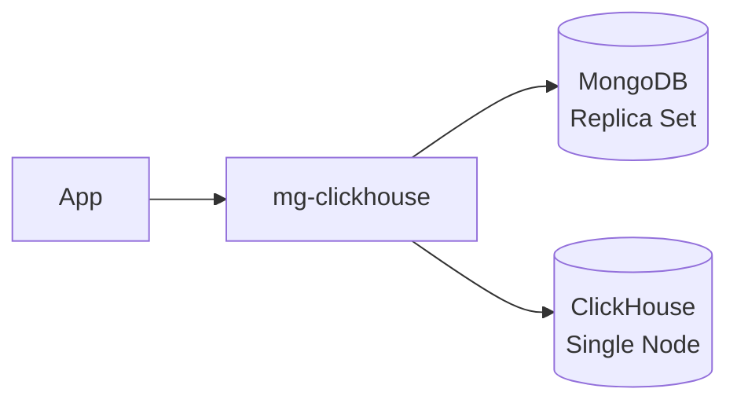

### 7.2 Production (Multi-Shard)

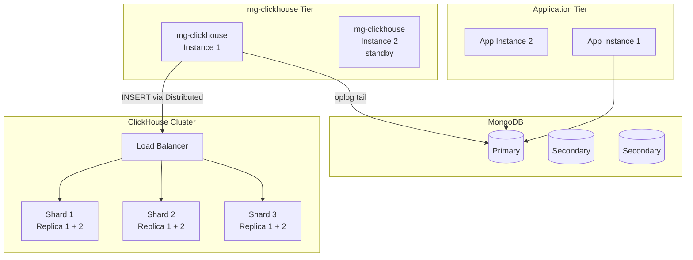

## 8. Failure Modes & Recovery

| Failure | Impact | Recovery |
|:--------|:-------|:---------|
| mg-clickhouse crash | Replication pauses | Restart resumes from last saved oplog position |
| ClickHouse unavailable | Batches accumulate in memory | Retries on next flush cycle; oplog position not advanced |
| MongoDB primary failover | Cursor dies | Reconnects with exponential backoff (3s base) |
| Corrupted resume token | Cannot resume from exact position | Starts from current oplog tail (may miss events during downtime) |
| Network partition (MG↔CH) | Flush failures | Rows retained in batch, retried until success |

## 9. Security Considerations

- Management API has no built-in authentication (deploy behind API gateway or service mesh)
- ClickHouse credentials URL-encoded to prevent injection via special characters
- CURL handles use RAII to prevent resource leaks
- Container runs as non-root user (`mgch`)
- Config supports environment variable substitution for secrets
- Resume token files created with restrictive permissions

## 10. Limitations & Future Work

**Current limitations:**
- Single mg-clickhouse instance per MongoDB replica set (no HA leader election)
- Partial updates (`$set`, `$inc`) not synced — only full document replacements
- Delete operations not propagated (relies on ReplacingMergeTree versioning)
- No backfill/initial sync — only captures changes from the point of deployment

**Planned improvements:**
- Leader election via MongoDB advisory locks for HA
- Initial bulk sync from MongoDB to ClickHouse on first deployment
- Partial update support via document re-fetch from MongoDB
- Metrics export (Prometheus endpoint)
- Rate limiting on management API
- TLS support for management API

## 11. Technology Stack

| Component | Technology | Rationale |
|:----------|:-----------|:----------|
| Language | C++17 | Low latency, zero-copy BSON handling |
| MongoDB driver | mongocxx 3.9 | Official C++ driver with tailable cursor support |
| ClickHouse protocol | HTTP (libcurl) | Universal compatibility, works with any ClickHouse deployment |
| HTTP server | cpp-httplib | Header-only, lightweight, sufficient for management API |
| Config | yaml-cpp | Human-readable, standard for infrastructure tools |
| JSON | nlohmann/json | Header-only, industry standard for C++ |
| Process manager | tini | Proper PID 1 signal handling in containers |
| Container base | Ubuntu 22.04 | Stable, well-supported, small runtime image |
